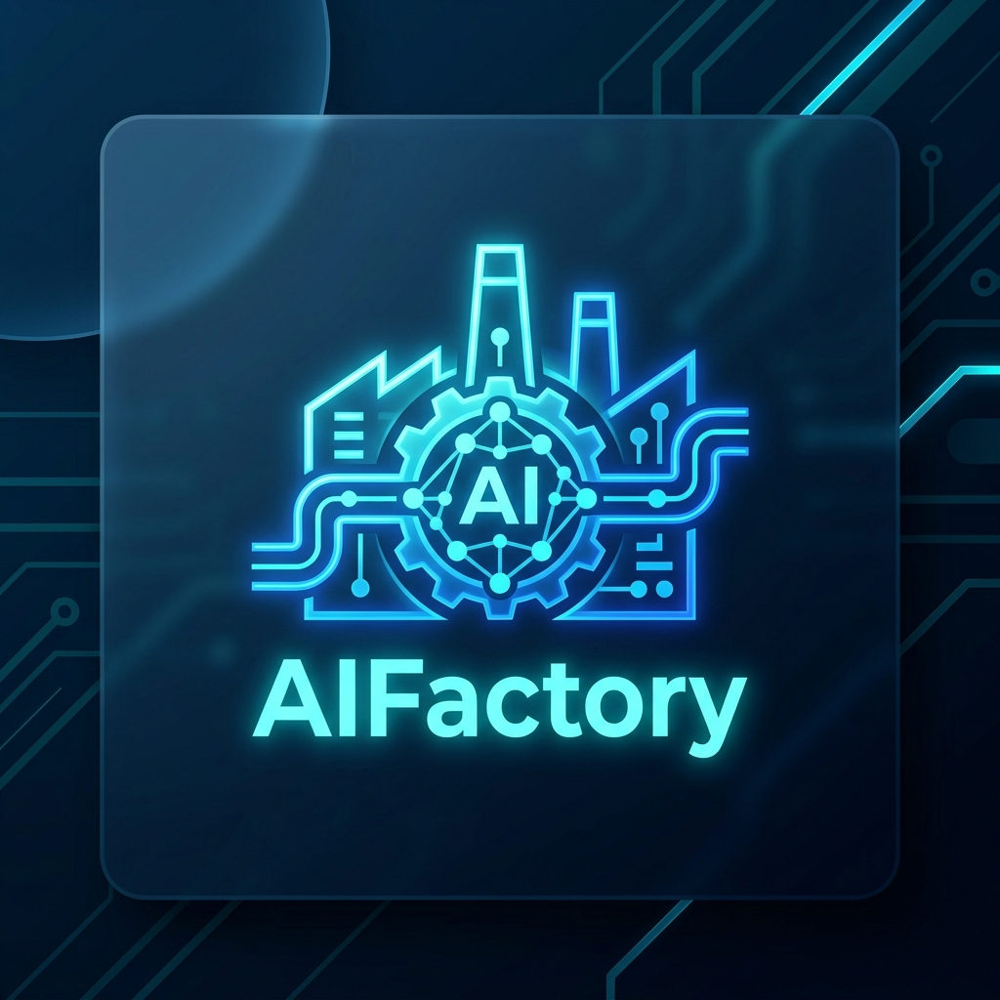
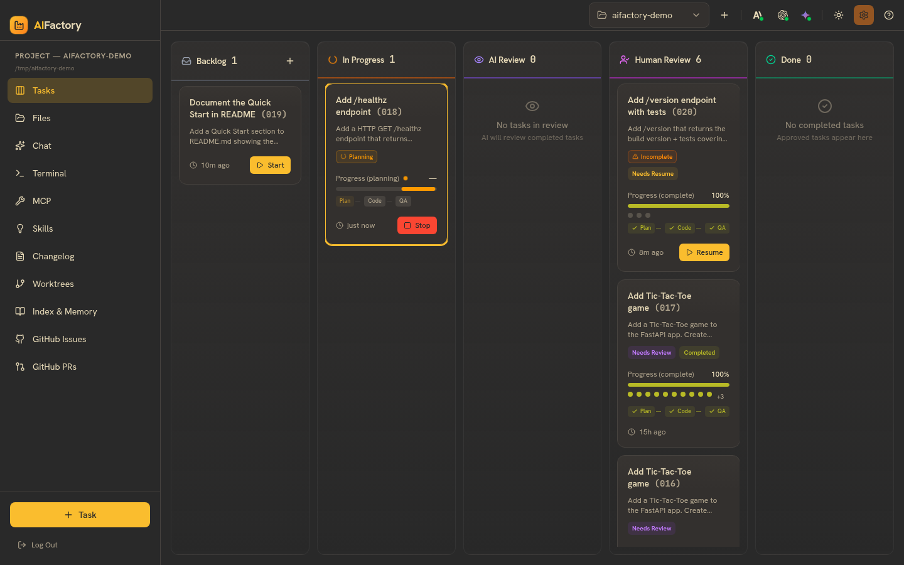
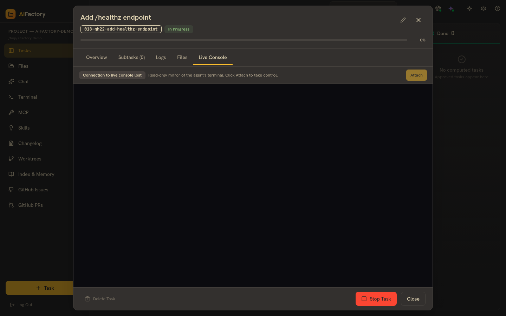
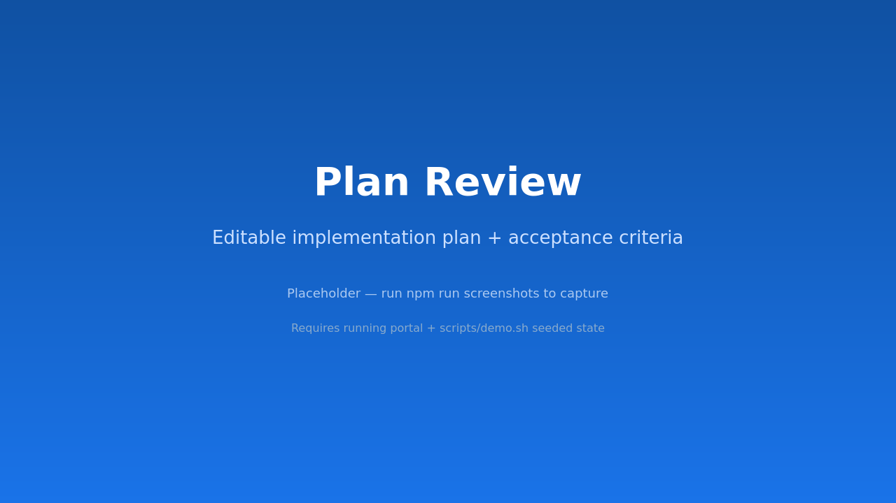
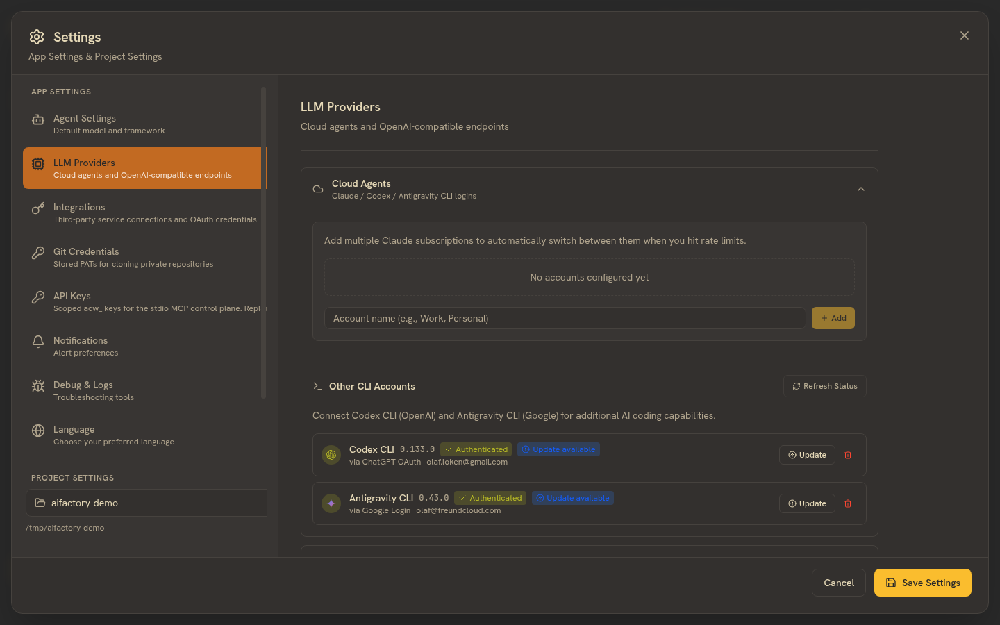

<div align="center">
  

# AIFactory

**Spec-Driven Development for AI agents — plan, code, ship.**

[](https://github.com/dataseeek/AIFactory/actions/workflows/ci.yml)
[](https://dataseeek.github.io/AIFactory/)
[](LICENSE)
[](https://nodejs.org/)
[](https://www.python.org/)

[Docs](https://dataseeek.github.io/AIFactory/) ·
[Demo](https://dataseeek.github.io/AIFactory/demo) ·
[Architecture](https://dataseeek.github.io/AIFactory/architecture/overview) ·
[Roadmap](https://dataseeek.github.io/AIFactory/roadmap) ·
[Contributing](https://dataseeek.github.io/AIFactory/contributing)

</div>

---

## What it is

AIFactory turns GitHub issues into shipping code via a coordinated **planner / coder / QA** agent pipeline. You bring an issue (or a one-line task description) — AIFactory writes a spec, plans the work, codes it in an isolated git worktree, validates against the spec's acceptance criteria, and hands you back a merge-ready branch.

You watch the whole thing happen live in the **Agent Console** — read-only by default, one-click Attach when you want to drive.

## Why it's different

- **Spec-first, not vibe-first.** Every agent run starts from a written, reviewable spec with acceptance criteria. Plans are editable before code is written.
- **Multi-provider by design.** Pick a model per phase. Plan with Claude Opus, code with a cheap local Ollama qwen3, validate with Sonnet. Anthropic / OpenAI / Ollama / Gemini / Codex / any OpenAI-compatible endpoint.
- **Isolated by default.** Each task runs in its own git worktree. Nothing touches your working tree until you merge.
- **Auditable.** Hash-chained audit log, on-disk specs+plans+QA reports, full SOC2 evidence catalog in the enterprise build.

## Quickstart (60 seconds)

```bash
git clone https://github.com/dataseeek/AIFactory
cd AIFactory
npm run install:all
claude setup-token   # paste into apps/backend/.env as CLAUDE_CODE_OAUTH_TOKEN
```

Start the two servers (in separate terminals):

```bash
cd apps/web-server  && python -m server.main         # :3101
cd apps/frontend-web && npm run dev                  # :3100
```

Open <http://localhost:3100> and create your first project.

Full installation guide: **[Getting Started →](https://dataseeek.github.io/AIFactory/getting-started)**

## See it work

The repo ships with an end-to-end demo that walks through the full flow against a public sample repo:

```bash
./scripts/demo.sh
```

It seeds 3 GitHub issues, registers the demo repo with your portal, imports the issues as backlog tasks, prompts you to drive Claude Code from the terminal, then kicks off an autonomous build — all in about 90 seconds. Pass `--yolo` to skip the Enter-prompts between steps.

Walkthrough with screenshots: **[Demo →](https://dataseeek.github.io/AIFactory/demo)**

## Screenshots

<table>
  <tr>
    <td></td>
    <td></td>
  </tr>
  <tr>
    <td></td>
    <td></td>
  </tr>
</table>

> Screenshots are auto-captured by `scripts/capture-screenshots.ts` — refresh them with `npm -w apps/frontend-web run capture-screenshots`.

## Documentation

The full documentation lives at **<https://dataseeek.github.io/AIFactory/>**:

- **[Getting Started](https://dataseeek.github.io/AIFactory/getting-started)** — install + first task
- **[Demo](https://dataseeek.github.io/AIFactory/demo)** — guided end-to-end walkthrough
- **[Concepts](https://dataseeek.github.io/AIFactory/concepts/spec-driven-development)** — spec-driven development, multi-provider routing, the rmux Live Console
- **[Architecture](https://dataseeek.github.io/AIFactory/architecture/overview)** — agents, data flow, security model, Mermaid diagrams
- **[Wiki](https://dataseeek.github.io/AIFactory/wiki/faq)** — FAQ, troubleshooting, glossary
- **[Compliance](https://dataseeek.github.io/AIFactory/compliance/soc2)** — SOC 2 evidence, GDPR, encryption-at-rest

Legacy guides (pre-2026-05-26 rewrite) are archived under [`docs-archive/2026-05-26/`](docs-archive/2026-05-26/) and remain searchable in git history.

## Stack

- **Frontend** — React 19 + Vite + xterm.js + Tailwind v4
- **Web Server** — FastAPI + WebSocket, Postgres + Alembic migrations
- **Agent Runtime** — Python 3.12, Claude Agent SDK, provider abstraction over Anthropic / OpenAI / Ollama / Gemini / Codex
- **Deploy** — Helm chart (`charts/aifactory/`), distroless cosign-signed images, OIDC SSO, KMS-backed encryption at rest

## Contributing

Branching: `dev` is the working branch. Branch from `origin/dev`, sign your commits (`git commit -s`), open PRs against `dev`. `main` is a release branch and only receives promotion merges.

```bash
git fetch origin
git checkout -b feat/my-feature origin/dev
git push -u origin feat/my-feature
gh pr create --base dev
```

CI runs ruff + pytest + frontend typecheck + Postgres acceptance + multiple compliance gates on every PR. Full guide: **[Contributing →](https://dataseeek.github.io/AIFactory/contributing)**

## License

[AGPL-3.0](LICENSE). For commercial / enterprise licensing options, contact <hello@dataseek.team>.

## Acknowledgements

Built with the [Claude Agent SDK](https://docs.anthropic.com/claude/docs/claude-agent-sdk), [FastAPI](https://fastapi.tiangolo.com/), [Docusaurus](https://docusaurus.io/), and [rmux](https://github.com/Helvesec/rmux) (terminal multiplexer fork in Rust, used for the Live Console).
