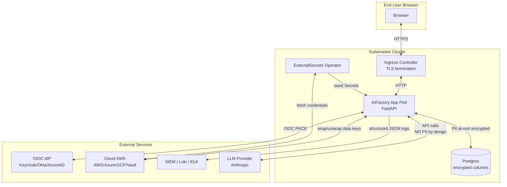

# Data Protection Impact Assessment + Data-Flow Diagram

> Framework: GDPR Article 35 (DPIA) + Article 30 (Records of
> Processing). For non-EU operators, the same template satisfies
> CCPA Cal. Civ. Code §1798.130 disclosure requirements and PIPL Art. 55.
> Status: v1.0 (closing Epic #26).

## 1. Purpose of processing

AIFactory is a self-hosted AI task management + agent orchestration
platform. Personal data is processed for the following purposes:

| Purpose | Lawful basis (GDPR Art. 6) | Categories of data |
| --- | --- | --- |
| User authentication + session management | Art. 6(1)(b) — contract | Email, name, OIDC sub, IP, JWT session |
| Organization membership + RBAC | Art. 6(1)(b) — contract | User ID ↔ Org ID, role assignment |
| Audit logging | Art. 6(1)(c) — legal obligation (SOC 2 / GDPR Art. 32) | User ID, action, IP, timestamp |
| AI task orchestration | Art. 6(1)(b) — contract | Task prompts + outputs (which MAY contain user-supplied PII — operator's responsibility) |
| Operational monitoring | Art. 6(1)(f) — legitimate interest (security + availability) | Aggregated metrics; correlation IDs; structured logs |

## 2. Data inventory (Records of Processing Art. 30)

| Element | Storage | Encryption | Retention | Erasure |
| --- | --- | --- | --- | --- |
| `users.email` | Postgres `users` table | At-rest (P2) | Until user deletion OR GDPR erasure | Hard-NULL on Art. 17 request |
| `users.name` | Postgres `users` table | At-rest (P2) | Until user deletion OR GDPR erasure | Hard-NULL on Art. 17 request |
| `users.oidc_sub` | Postgres `users` table | At-rest (P2) | Until user deletion OR GDPR erasure | Tombstone only; required for FK integrity |
| `email_accounts.access_token` | Postgres `email_accounts` | **AES-256-GCM via EncryptedString (P2.1)** | Until OAuth revoke OR user erasure | Hard-DELETE on Art. 17 request |
| `email_accounts.refresh_token` | Postgres `email_accounts` | **AES-256-GCM via EncryptedString (P2.1)** | Same as above | Same as above |
| `llm_endpoints.api_key` | Postgres `llm_endpoints` | **AES-256-GCM via EncryptedString (P2.1)** | Until rotated by operator | Operator-managed |
| `oidc_refresh_sessions.jti` | Postgres `oidc_refresh_sessions` | None (it's a session-tracking jti, not a secret) | 8 hours (refresh TTL) | Cleared on logout / IdP rejection |
| `audit_logs.user_id` | Postgres `audit_logs` | None at column level; chain-protected | 13 months (SOC 2 default) | SHA-256 hash on Art. 17 erasure (irreversible) |
| `audit_logs.details_json` | Postgres `audit_logs` | None at column level | 13 months | Regex-redacted on Art. 17 erasure |
| Correlation IDs (`X-Request-ID`) | Logs (stdout → Loki/ELK) | Operator's log-shipper config | Operator-managed | Operator-managed |

## 3. Data-flow diagram

### Trust boundaries

| Boundary | Crossing data | Protection |
| --- | --- | --- |
| Browser → Ingress | All user PII + session cookies | TLS 1.2+ (operator config) |
| Ingress → App | All user PII | mTLS (operator config) OR cleartext within cluster (NetworkPolicy enforces) |
| App → Postgres | Credentials (encrypted), audit logs | TLS in transit (operator config); AES-256-GCM at rest for credential columns |
| App → KMS | 32-byte data keys (in cleartext for wrap; ciphertext for unwrap) | TLS in transit; KMS provider's own audit log |
| App → LLM provider | **NO user PII by design** | Operator policy enforced via prompt filtering (out-of-scope for v1.0) |
| App → SIEM | Structured logs (may include user IDs in security events) | Operator's log-shipper TLS |

## 4. Risks identified + mitigations

### High-severity risks

| Risk | Likelihood | Impact | Mitigation |
| --- | --- | --- | --- |
| KMS root compromise → all wrapped data keys exposed | Low (cloud-managed) | High | KMS rotation runbook (P2.5/P2.6); per-org data keys limit blast radius |
| Audit log tampering by DB admin | Low (insider) | High | Hash chain (P5.2); external verifier; v1.1 signed anchor |
| LLM provider data residency violation | Medium (operator-dependent) | Medium | Documented limitation; v1.1 LiteLLM gateway with per-tenant routing |
| User-supplied prompts containing third-party PII | High (user behavior) | Medium-High | DOCUMENTED: operator's responsibility. v1.1 PII detector in LiteLLM gateway. |

### Medium-severity risks

| Risk | Mitigation |
| --- | --- |
| Token exfiltration via logs | OAuth tokens stored encrypted; never logged (verified via `tests/secrets/test_p2_encrypted_string.py::test_no_plaintext_in_stored_bytes`). |
| Backup data leaks plaintext | Backups contain ciphertext only (P2.3 column migration ensures even pre-encryption rows are encrypted post-migration). |
| Cross-tenant data leak via cache | Per-org data keys (`DataKeyManager` keyed by `org_id`); test `test_data_key_isolation_between_orgs` gates this. |

### Low-severity risks (residual; documented for completeness)

| Risk | Mitigation |
| --- | --- |
| TLS-intercepting proxy MitM | `global.customCABundle` Helm value mounts customer CA. |
| Single-replica WS DoS | Documented limitation; v1.1 multi-replica. |
| Pruned audit log can't verify pre-prune chain | Documented in `guides/operations/audit-trail.md`. |

## 5. Data subject rights (GDPR Articles 15-22)

| Right | Implementation in v1.0 |
| --- | --- |
| Art. 15 — Access | Self-service via `/api/auth/me` for the user's own data. Org admins can export audit trails via `/api/audit/export`. |
| Art. 16 — Rectification | User profile edit endpoints (existing in `apps/web-server/server/routes/auth_routes.py`). |
| Art. 17 — Erasure (right to be forgotten) | `POST /api/users/{id}/gdpr-erasure` (P5.5). Audit chain re-verifies post-erasure. |
| Art. 18 — Restriction of processing | Operator-side: deactivate `users.is_active=false` to suspend account access. |
| Art. 20 — Data portability | JSON/CSV export via `/api/audit/export` for audit data; project-data export is v1.1. |
| Art. 21 — Objection | Not applicable (no profiling / direct marketing in v1.0). |
| Art. 22 — Automated decision-making | Not applicable (AI agents are operator-configured, not user-targeted decisions). |

## 6. Cross-border data transfer (GDPR Chapter V)

AIFactory is **self-hosted**. Cross-border transfer questions are
the operator's concern, not the product's. The product does
**not** independently transfer personal data to any third party
EXCEPT:

- LLM provider calls (Anthropic by default). Operator MUST ensure
  appropriate Article 46 safeguards (SCCs) are in place with their
  LLM provider OR route via an EU-region endpoint.
- Cloud KMS calls (AWS / Azure / GCP). Same SCC requirement.

The application makes NO outbound calls to any AIFactory-owned
infrastructure.

## 7. Data Protection Officer (DPO) contact

This is the operator's responsibility — the product doesn't ship a
default DPO. Document your DPO contact in the deployment runbook so
data subjects can exercise their rights.

## 8. DPIA review cadence

| Trigger | Action |
| --- | --- |
| Major version release | Full re-review (architecture diagram + risk matrix). |
| New data category | Add row to §2 inventory; re-classify. |
| New cross-border transfer | Update §6 + ensure SCCs in place. |
| Incident | Update §4 risks + mitigations. |

## 9. Reviewer signoff

| Role | Name | Date |
| --- | --- | --- |
| Author | Olaf Krasicki-Freund | 2026-05-25 |
| DPO | _operator-supplied_ | _at deployment_ |
| Legal | _operator-supplied_ | _at deployment_ |
