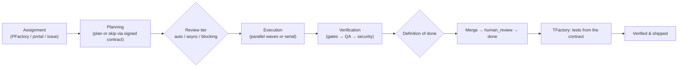

The hardest question in agentic software delivery isn't "can the model write the
code?" — it usually can. It's **"how do you know it's actually finished?"** An
agent that declares success is not evidence. A green checkmark it drew itself is
not a gate.

So we made "done" a property of *checks that ran*, not of an agent's confidence.
This post walks the full path a unit of work takes through AIFactory — how it's
assigned, planned, executed, and verified — and explains the reasoning behind
each fork.

<!-- truncate -->

## The whole flow on one page

The fully detailed version — with the self-heal loop, the QA-fixer loop, the
pre-merge gate, and the handback path — lives in the docs:
[Pipeline Flow](/docs/concepts/pipeline-flow). Here I want to explain *why* it's
shaped this way.

## 1. Assignment: trust, but verify the plan

Work arrives three ways: a governed plan from **PFactory**, a task from the
portal/CLI, or a GitHub issue. The interesting case is the first one.

PFactory already does the heavy analysis — architecture, security, feasibility,
cost — and emits a plan. Re-doing that analysis inside AIFactory is wasteful and,
worse, it *drifts*: two planners, two answers. So we let PFactory hand over a
**signed Task Contract** (an HMAC-signed `implementation_plan.json` plus an
execution profile). AIFactory verifies the signature and a completeness
checklist, and if it passes, **skips its own planning entirely** and goes
straight to building.

> The decision: *don't re-plan what was already planned and governed — but never
> trust an unsigned plan.* Trust is earned by a signature, not by a label.

## 2. Planning: a plan you can schedule and check

Whether planned here or handed over, the artifact is the same:
`implementation_plan.json` — phases and subtasks with explicit `depends_on`, file
footprints, per-subtask verification, and the `required_commands` a build needs
to test itself. That structure isn't bureaucracy; it's what makes the next two
stages possible. Dependencies + file footprints let us run subtasks in parallel
safely. Per-subtask verification is what "done" is later measured against.

## 3. Review tier: put the human where the risk is

Not every change deserves the same scrutiny, and a human gate on every task
destroys throughput. So the plan is classified into a **review tier**:

- **auto** — trusted/trivial work proceeds.
- **async** — the agent keeps building; humans comment on artifacts and the
  feedback folds in between waves. No halting.
- **blocking** — high-risk paths (auth, secrets, migrations, infra, payments) or
  low planner confidence require a human *before* code and *before* merge.

> The decision: *spend review where the risk is.* Most work shouldn't wait on a
> human; the dangerous 10% should never merge without one.

## 4. Execution: fast without losing the thread

Independent subtasks run as **parallel waves** in isolated git sub-worktrees,
then merge back sequentially. You get concurrency *and* a clean, reviewable
history — speed doesn't cost auditability. (We wrote about the throughput win
[here](/blog/parallel-build-executor).) A subtle but important detail: each
agent's command allowlist is seeded from the plan's `required_commands`, so a
from-scratch build can actually run its own `pytest`/`ruff`/`mypy` instead of
getting blocked.

## 5. Verification and the definition of done

This is the part that matters. A unit is **done** only when *all* of these hold:

- **Every subtask is `completed`** — no pending, failed, or orphaned work.
- **QA acceptance criteria pass** — a QA reviewer signs off; a bounded QA-fixer
  loop resolves what it can.
- **All gates are clear** — per-subtask test/lint/typecheck passed, and a
  **security pre-merge gate** found no secrets/injection at or above the block
  threshold.
- **The review tier is satisfied** — any required human approval was given.

Only then does the branch merge and the task move `human_review → done`. And
"done" isn't the end of trust: **TFactory** then generates and runs tests from
the contract's test profile. Failures hand back to the QA fixer in a bounded
loop — never a silent pass.

When self-healing is enabled, a failed gate doesn't just stop — it triggers
diagnose → bounded retry → rollback to the last checkpoint → escalate. Bounded,
checkpoint-backed, and it escalates to a human on exhaustion rather than
thrashing. Security and destructive triggers escalate immediately.

> The decision: *"done" is the conjunction of independent checks that ran.* If
> you can't point at the gate that passed, it isn't done.

## What this solves

- **No "the agent said so" merges.** Every completion is backed by checks you can
  inspect and replay.
- **No duplicated planning.** A signed contract lets the planner's work flow
  downstream instead of being redone.
- **No throughput tax for safety.** Risk-tiered review keeps humans out of the
  trivial path and firmly in the dangerous one.
- **No speed-vs-audit tradeoff.** Parallel waves merge into a coherent history.
- **No runaway agents.** Self-healing is bounded and escalates.

The pipeline is opinionated on purpose. The opinions are all the same one: a unit
of work is finished when the system can *prove* it, not when a model *claims* it.

*Full detail: [Pipeline Flow](/docs/concepts/pipeline-flow) ·
[Task Lifecycle](/docs/task-lifecycle) · [Task Contract v2](/docs/task-contract).*
