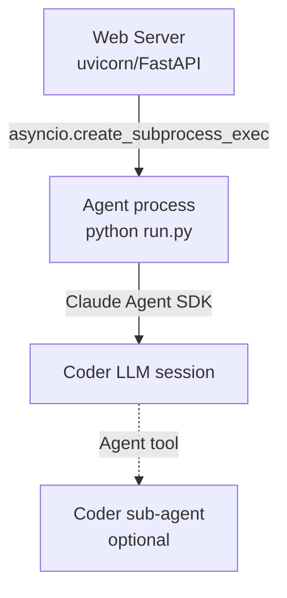

# Data Flow

How a task's state moves through disk, processes, and the network.

## Per-task disk layout

```
<project>/.aifactory/specs/<spec-id>/
├── spec.md
├── requirements.json
├── context.json
├── implementation_plan.json
├── task_metadata.json
├── qa_report.md
├── build-progress.txt          ← agent's narrative output
└── QA_FIX_REQUEST.md           ← present only while QA is asking for fixes
```

The **spec-id** is generated as `NNN-<slug>` (e.g., `001-add-healthz-endpoint`). It's lexicographically ordered so listings are stable.

## Worktree isolation

Each task runs in an **isolated git worktree** under `.aifactory/worktrees/tasks/<spec-id>/`. The agent's code edits land there, never in the user's working tree.

```
<project>/
├── (user's working tree)
└── .aifactory/
    ├── specs/<spec-id>/         ← spec artifacts (main)
    └── worktrees/tasks/<spec-id>/
        ├── (full repo checkout on branch auto-claude/<spec-id>)
        └── .aifactory/specs/<spec-id>/   ← agent writes here
```

The web-server **syncs files** from the worktree's spec dir to the main spec dir every 3 seconds during task execution (see `agent_service.py::_sync_worktree_files`) so the UI sees agent progress in real time.

## Process tree



## WebSocket events

The frontend subscribes to per-task WebSocket channels:

| Event | Payload | When |
|---|---|---|
| `task:update` | full task dict | Status or phase changes |
| `task:log` | `{spec_id, lines}` | Coder writes to `build-progress.txt` |
| `task:subtask` | subtask delta | A subtask transitions state |
| `task:qa` | `qa_report.md` content | QA reviewer publishes a report |
| `agent-console:bytes` | raw pane bytes (binary frame) | rmux Live Console |

## Audit log

Every state-changing API call writes a row to the `audit_logs` table. Rows are **hash-chained** — each row stores `prev_hash` of the previous row, so tampering with any row breaks the chain (Epic #26 P5).

The audit log is exportable as CSV/JSON for GDPR data-subject-access requests via `GET /api/orgs/{org}/audit-logs`.

## Branching strategy

```
main           ← user's branch
└── auto-claude/<spec-id>   ← spec branch, isolated worktree
```

- **One** branch per spec. Parallel work uses sub-agents within the same branch, not parallel branches.
- **No** automatic pushes to GitHub. The user reviews in the worktree and clicks Merge when ready.
- The merge button in the portal does `git checkout main && git merge --no-ff auto-claude/<spec-id>` — no force-push, no rebase, no rewriting history.
