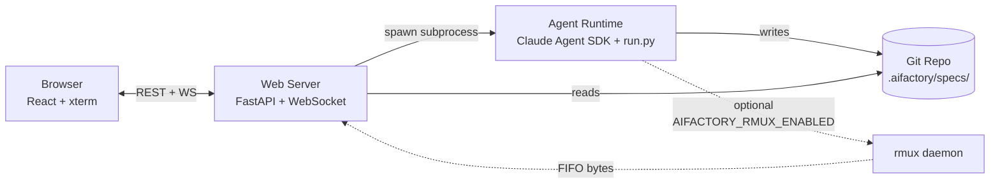
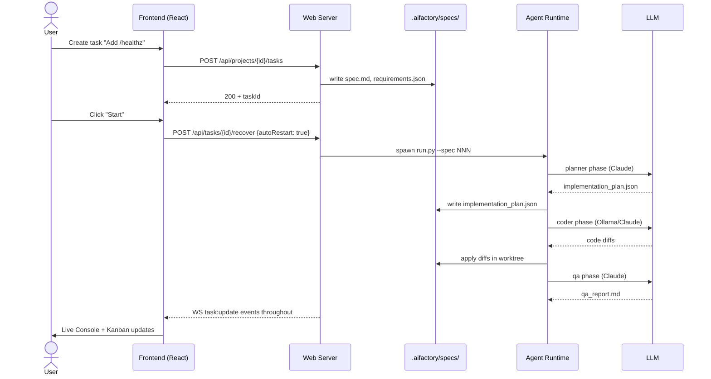

# Architecture Overview

AIFactory has three runtime components:



- **Frontend** (`apps/frontend-web/`) — React 19 + Vite + xterm. Talks REST + WebSocket to the web-server.
- **Web Server** (`apps/web-server/`) — FastAPI service. Handles auth, project/task CRUD, GitHub integration, audit logging. Spawns the agent runtime as a subprocess per task.
- **Agent Runtime** (`apps/backend/`) — The Python CLI (`run.py`, `spec_runner.py`) that drives the agent pipeline. Talks to LLM providers via the Claude Agent SDK or the provider abstraction.

## Where the code lives

```
apps/
├── frontend-web/   # React UI (browser, port 3100)
├── web-server/     # FastAPI (port 3101)
└── backend/        # CLI + agent runtime (subprocess)
```

## How a task moves through the system



## Security model

Three defense layers, applied at every agent run:

1. **OS sandbox** — bash commands are isolated; the agent process can't escape the project directory
2. **Filesystem permissions** — agents can only touch files under `project_path`
3. **Command allowlist** — dynamically generated from the detected project stack (see `apps/backend/core/security.py` and `project_analyzer.py`); cached in `.aifactory-security.json`

OAuth tokens never leak to subprocesses. The `ANTHROPIC_API_KEY` is scrubbed from the env passed to `run.py` (see commit `017eed3`); only the OAuth-issued token reaches Claude.

## Where to dig next

- **[Agents →](./agents)** — what each agent does and what prompts drive it
- **[Data Flow →](./data-flow)** — how worktrees, sessions, and audit logs interact
- **API Reference →** auto-generated from the FastAPI OpenAPI spec (Phase B2 follow-up)
