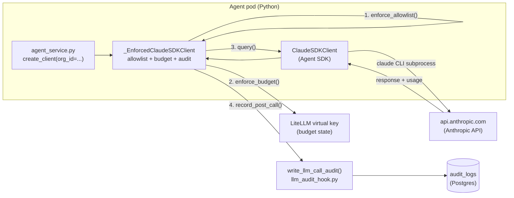

# Claude Enforcement Wrapper (v1.2 / #207)

## Why this exists

In v1.1 (#38), AIFactory ships LiteLLM as the gateway for OpenAI-compatible
providers (OpenAI, Codex, Gemini, Ollama, Bedrock, Vertex). Every call through
that path gets:

- Per-tenant model allowlist enforcement.
- Per-tenant daily budget enforcement.
- Per-call PII-redacted audit row (`llm.call` / `.abandoned` / `.failed`).
- Prometheus per-tenant cost metrics.

**Claude calls bypassed all of that.** The Claude Agent SDK spawns the `claude`
CLI subprocess, which speaks the Anthropic-format `POST /v1/messages` endpoint —
wire-incompatible with LiteLLM's OpenAI-format `POST /v1/chat/completions`
endpoint. v1.2 closes this gap with an in-process wrapper that mirrors LiteLLM's
enforcement plane without requiring a network hop.

The wrapper is described in full in
`docs/plans/2026-05-29-claude-litellm-wrapper-design.md` (Option A was chosen
over Option B — LiteLLM Anthropic passthrough — due to four open upstream bugs
that corrupt audit-row integrity on AIFactory's exact code path).

## Architecture



**Call sequence for an org-bound Claude session:**

1. `agent_service.py` calls `create_client(org_id='org-abc', ...)`.
2. `build_enforcement_context()` builds a `ClaudeEnforcementContext` from the
   org's allowlist + a `LiteLLMBudgetProvider` (when LiteLLM is deployed).
3. `enforce_allowlist()` raises `ModelNotAllowedError` fast — before the SDK
   subprocess spawns — if the model is not in the org's list.
4. The wrapped client is returned. On `__aenter__`, `enforce_budget()` reads
   the org's LiteLLM virtual-key spend + max_budget.  If exhausted →
   `BudgetExceededError`.
5. The underlying `ClaudeSDKClient` runs the claude CLI as normal.
6. On `__aexit__` (success, `CancelledError`, or exception), the wrapper calls
   `record_post_call()` which writes one audit row via `write_llm_call_audit()`.
   PII redaction and the 4 KB truncation cap apply identically to the
   non-Claude path.

## Per-call vs per-session audit row

The wrapper produces **one audit row per `create_client()` invocation**. A
50-turn agentic session (Claude calling tools 50 times) produces one audit row
that records the assembled final token count + cost for the whole session.
Per-turn tool-use audit (one row per `tool_use` / `tool_result` pair) is
parking-lot for v1.3.

This matches the non-Claude path: `OpenAICompatibleProvider` also produces one
row per API call, not per streaming chunk.

## Audit row shape

The Claude path produces **byte-identical audit rows** to the non-Claude path:

| Field | Value |
|---|---|
| `action` | `llm.call` / `llm.call.abandoned` / `llm.call.failed` |
| `resource_type` | `"llm"` |
| `resource_id` | model string (e.g. `"claude-opus-4-7"`) |
| `classification` | `"confidential"` |
| `details_json.model` | model string |
| `details_json.input_tokens` | from SDK `result.usage` |
| `details_json.output_tokens` | from SDK `result.usage` |
| `details_json.cost_usd` | estimated from `_CLAUDE_PRICING` dict |
| `details_json.cost_source` | `"litellm_estimate"` (approximate) |
| `details_json.provider` | `"claude_sdk"` (new in v1.2 — backward-compat) |
| `details_json.latency_ms` | wall-clock from `__aenter__` to `__aexit__` |
| `details_json.litellm_request_id` | `null` (no LiteLLM on this path) |
| `details_json.truncated` | `true` for abandoned streams |

The `provider="claude_sdk"` field lets chargeback queries split Claude vs
non-Claude spend cleanly. Existing queries that filter on `action='llm.call'`
are unaffected — the new field is additive.

## Cost estimation

Token counts come from the SDK's `ResultMessage.usage` (exact). Cost is
estimated in-process from the `_CLAUDE_PRICING` dict in `core/enforcement.py`:

```python
# Per-million-token rates (USD). Requires manual bump on Anthropic model release.
_CLAUDE_PRICING = {
    'claude-opus-4-7':  {'input': 15.0, 'output': 75.0, ...},
    'claude-sonnet-4-6': {'input': 3.0, 'output': 15.0, ...},
    ...
}
```

Out-of-date rates produce underestimates flagged by `cost_source='litellm_estimate'`.
Operators using the audit rows for chargeback should reconcile against their
Anthropic invoice monthly.

## Helm operator recipe

### Enable the wrapper (recommended for multi-tenant deployments)

```yaml
# charts/aifactory/values.yaml
claude:
  enforcement:
    enabled: true
    failureMode: "open"   # or "closed" — see Failure mode below
```

### Failure mode trade-off

| `failureMode` | Budget service DOWN | Compliance posture |
|---|---|---|
| `"open"` (default) | Log WARNING, proceed | Call succeeds; budget overrun possible |
| `"closed"` | `BudgetCheckUnavailableError` | Claude calls fail; no overrun |

Use `"closed"` in strictly regulated deployments where an unaudited call is
worse than a failed call. Use `"open"` (the non-Claude default from #38) to
avoid cascading failures during a LiteLLM gateway restart.

### Env vars (set automatically by the Helm chart)

| Env var | Description |
|---|---|
| `AIFACTORY_CLAUDE_ENFORCEMENT_ENABLED` | `"true"` when `claude.enforcement.enabled=true` |
| `AIFACTORY_CLAUDE_ENFORCEMENT_FAILURE_MODE` | `"open"` or `"closed"` |

### Deployment modes

| `org_id` passed | LiteLLM enabled | Allowlist | Budget | Audit |
|---|---|---|---|---|
| No | any | Skipped | Skipped | Skipped |
| Yes | Yes | Enforced | Enforced | Written |
| Yes | No | Enforced | Skipped + WARNING | Written |

A Claude-only deployment (no LiteLLM) still gains allowlist enforcement and
per-call audit rows — the two highest-value pieces. Budget enforcement activates
when LiteLLM is deployed and the org has a virtual key.

## Budget enforcement caveats

### Race window (multi-replica)

Two replicas can each read "$3 remaining" and both proceed. The over-spend cap
is one call per replica per budget window (cents to single-digit dollars —
never the multi-hundred-dollar runaway the wrapper is here to prevent). The
next call after the window refills correctly sees $0. This is a known,
documented limitation; an `INCRBY`-reservation approach is parking-lot v1.3.

### Per-tenant Anthropic billing

v1.2 uses ONE deployment-wide Anthropic API key. The wrapper enables
**per-tenant chargeback** via audit rows — operators run billing queries against
`audit_logs WHERE action='llm.call' AND details_json->>'provider'='claude_sdk'`.
Anthropic still issues one invoice for the whole deployment.

### In-session over-spend

A 50-turn tool-use session that spends $50 within a single `query()` call
produces one audit row of $50 after the fact. The pre-call budget check only
blocks the **next** session. The in-session over-spend cap is bounded by
`max_turns=1000` (already set in `core/client.py`) × per-turn cost.

## Performance overhead

Per Claude session with enforcement enabled:

| Operation | Typical latency |
|---|---|
| Allowlist check | < 1 ms (synchronous, no I/O) |
| Budget pre-check (LiteLLM admin API) | 50–200 ms |
| Audit row write | < 20 ms |
| **Total added overhead** | ~100–300 ms |

Claude Opus sessions run 10–60 s. The overhead is 1–3%.

## When NOT to use enforcement

Call sites that pass **no `org_id`** to `create_client()` receive the bare
`ClaudeSDKClient` — no enforcement, no audit row. This is intentional for:

- `apps/backend/spec_runner.py` — operator-local spec creation.
- `apps/backend/run.py` — direct CLI build runner.
- `apps/backend/runners/insights_runner.py` — system-level insight extraction.
- Any background runner without a tenant context.

These are "trusted operator-local invocations" — the same pattern as
`OpenAICompatibleProvider(allowed_models=None)` for trusted test contexts.
A v1.3 milestone may add an `--org-id` flag to the CLI runners.

## When to revisit Option B (LiteLLM Anthropic passthrough)

Option B was evaluated and rejected in v1.2 due to four open upstream bugs:

- **BerriAI/litellm #28562** — passthrough `request_id` mismatch breaks audit row cross-reference.
- **BerriAI/litellm #28228** — cost tracking ignores router pricing on passthrough.
- **BerriAI/litellm #26749** — `server_tool_use` parsed as dict instead of typed object.
- **BerriAI/litellm #27512** — passthrough retry drops `thinking` content for Opus 4.7.

Monitor these issues on the BerriAI/litellm tracker. When all four are closed,
v1.3 can evaluate unifying the enforcement plane into LiteLLM (removing the
Claude-specific wrapper). The wrapper's public interface is intentionally narrow
so the swap remains a single-file change.

## Cross-references

- [LiteLLM Gateway concept](litellm-gateway.md) — the v1.1 enforcement plane that Claude was not part of.
- [Audit Anchor concept](audit-anchor.md) — the hash-chain that wraps every audit row (applies to Claude rows too).
- `apps/backend/core/enforcement.py` — wrapper implementation.
- `docs/plans/2026-05-29-claude-litellm-wrapper-design.md` — locked design with full decision audit trail.
