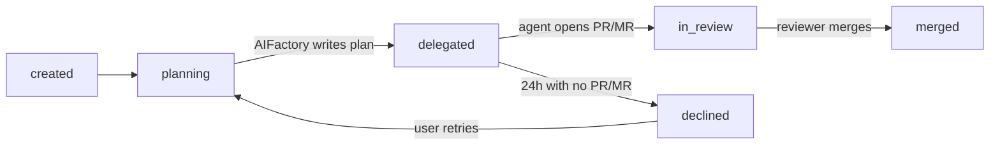

# Delegation — let your provider's agent do the coding, keep AIFactory's planning + governance

> *AIFactory drafts the spec and the implementation plan. GitHub Copilot Coding Agent (GitHub projects) or GitLab Duo Workflow (GitLab projects) writes the code.*

Delegation hands the coder + QA phases off to the project's autonomous coding agent — **GitHub Copilot Coding Agent** on GitHub projects, **GitLab Duo Workflow** on GitLab projects. Uses your Copilot/Duo seat instead of spending Claude tokens on the build. AIFactory's value (spec authoring, plan structuring, governance) still runs on every task; only the implementation phase moves.

It is **hybrid only** — AIFactory always runs the planner first and posts the enriched plan as a structured comment on the issue. Copilot sees both the original issue and AIFactory's `## ✨ AIFactory enrichment` comment before it starts.

## When to use it

- Your team has unused Copilot Coding Agent credits and wants to put them to work.
- The task is a good fit for Copilot's strengths (CRUD endpoints, small refactors, well-scoped bug fixes).
- You want AIFactory's planning rigor + tracked status without spending Claude tokens on coding.

When **not** to use it:

- Highly architectural changes — Copilot still does best on smaller, well-defined work. Run those on AIFactory's local agent.
- Anything that needs to land before Copilot's polling cadence resolves — delegated tasks update every 5 minutes, not in real time.
- Anything sensitive enough that you don't want a third-party agent touching it.

## How to enable

### Per-task

In the Task Creation Wizard's Advanced section, tick **"Delegate coding to the project's autonomous agent"**. The checkbox is disabled with a tooltip on Azure DevOps projects (no equivalent agent exists). On GitHub projects it delegates to Copilot; on GitLab projects it triggers Duo Workflow.

### Per-project

In **Project Settings → General**, toggle **"Delegate coding to Copilot for new tasks by default"**. Every new task in that project starts with delegation enabled. The per-task wizard toggle still wins on a case-by-case basis.

The "Delegated to Copilot ↗" badge appears on the task detail panel once a task is delegated. It links to Copilot's resulting PR once one is opened (within ~5 minutes); until then it links to the originating issue.

## Provider differences

The hybrid model is identical across providers — AIFactory's planner runs locally, posts the enriched comment, then hands off. The wiring differs slightly:

| | GitHub Copilot | GitLab Duo Workflow |
|---|---|---|
| Trigger | Assign `copilot-swe-agent` via GraphQL `replaceActorsForAssignable` | POST `/api/v4/ai/duo_workflows/workflows` with the workflow payload |
| Entitlement | Org-level Copilot Coding Agent permissions on the repo | Duo Pro or Duo Enterprise add-on on the namespace (GitLab Premium 17.4+ floor) |
| Auth | `gh` CLI token (Copilot scope) | Project `gitToken` setting (Bearer header, **not** `PRIVATE-TOKEN`) |
| Result | Bot-authored PR titled with `#<issue-num>` | Bot-authored MR referencing the workflow id |
| AIFactory tracks via | `delegation_tracker.scan_delegated_tasks` polling matching PRs | Same tracker, polling matching MRs |

Both surface in the UI as identical `delegated` → `in_review` transitions. The "Delegated to Copilot ↗" badge text reads "Delegated to Duo ↗" on GitLab projects.

## Status flow

The status machine is provider-agnostic. Replace "Copilot" with "Duo" mentally if your project is on GitLab.



| Status | Meaning |
|---|---|
| `created` | Task accepted by Auto-Fix; not yet started. |
| `planning` | AIFactory's planner phase is producing `implementation_plan.json`. |
| `delegated` | Planner is done. Comment posted. Copilot assigned to the issue. AIFactory is now polling for Copilot's PR. |
| `in_review` | Copilot opened a PR referencing the issue. AIFactory has linked `prNumber` + `prUrl` on the task. |
| `merged` | PR was merged. The originating issue closes automatically per Copilot's commit message. |
| `declined` | 24 hours elapsed with no matching PR. AIFactory surfaces a notice; you can re-run with the local agent. |

The 5-minute polling lag comes from piggybacking on the existing Auto-Fix poll. A webhook-driven receiver is on the roadmap.

## What AIFactory's enrichment comment contains

A single comment posted on the originating issue. Four sections + a footer:

```markdown
## ✨ AIFactory enrichment

### Spec
[body of spec.md, with the H1 stripped to avoid duplicating the issue title]

### Acceptance criteria
- [ ] [each line of the plan's acceptance_criteria]

### Affected files
- `[path/to/file.py]`
- `[path/to/test.py]`

### Implementation plan
**[Phase name]**
- [subtask description]
- [subtask description]

---
_AIFactory drafted this plan. @Copilot — please implement._
```

Format lives in `apps/web-server/server/services/delegation_formatter.py`. If `implementation_plan.json` is missing fields, each section degrades to a single explanatory line rather than failing the post.

## Limitations

- **Org-level Copilot Coding Agent permissions.** If the org admin has disabled Copilot Coding Agent on the repo, `assign_to_user(["Copilot"])` silently no-ops. AIFactory detects this by re-reading the issue's assignees after the call — if `copilot-swe-agent` isn't there, the task surfaces a notice.
- **GitLab Duo entitlement.** GitLab projects need a Duo Pro or Duo Enterprise add-on attached to the namespace (GitLab Premium 17.4+ is the floor). The Duo Workflow API authenticates with `Authorization: Bearer <token>` (not `PRIVATE-TOKEN`) — configure the project's `gitToken` setting accordingly. Calls to `POST /api/v4/ai/duo_workflows/workflows` return 401/403 without an active Duo seat; AIFactory silently no-ops on those and the tracker detects the miss by polling for the resulting MR.
- **Azure DevOps.** Permanently unsupported — ADO has no autonomous coding agent equivalent. The toggle stays disabled.
- **Polling lag.** Up to 5 minutes between Copilot opening a PR and the AIFactory UI reflecting it. Webhook-driven receiver TBD.
- **Decline detection is heuristic.** "24h with no matching PR" → declined. If Copilot opened a PR with a title that doesn't reference `#<issue-number>`, the tracker won't link it and the task may incorrectly be marked declined. Title conventions matter.

## FAQ

### What happens when Copilot declines?

After 24 hours with no matching PR, the task transitions to `declined` and emits a notice. You have two options:

1. **Retry with the local AIFactory agent** — uncheck "Delegate" on the same spec and re-trigger. AIFactory's planner output is preserved, so the local coder starts from a richer context than a fresh task.
2. **Re-assign Copilot manually** — sometimes Copilot just needed a more concrete prompt. Click the issue link, add a comment, and re-assign `@copilot-swe-agent`.

### Where do I see Copilot credit usage?

AIFactory does not track Copilot premium-request usage. Check your **[GitHub Copilot usage dashboard](https://github.com/settings/copilot/usage)** for individual accounts, or your org's billing page for org-level usage.

### What does AIFactory do if Copilot opens a flawed PR?

Nothing in V1. The PR shows up as `in_review` and that's where AIFactory hands off to the human reviewer. Ensemble PR reviews (where AIFactory auto-reviews Copilot's output) are planned for a separate epic — see the roadmap.

### Does delegation cost zero Claude tokens?

No — but close to it. The planner phase still runs on Claude. For a project averaging 50 delegated tasks/month with the default Sonnet planner, expect **roughly \$5/month** in planner-phase Claude spend. This is ~10× cheaper than running the full pipeline locally for the same tasks, where the coder phase dominates the bill.

If even that is too much, switch the planner's model to `claude-haiku-4-5` for the project — drops planning cost ~5×.

### Can I delegate just *some* tasks?

Yes. The per-project default is just a default. The wizard checkbox lets you flip delegation on or off for any individual task at creation time.

### What if Copilot's PR is broken / partial?

It shows up as `in_review` like any other PR. The human reviewer (you) is the merge gate. AIFactory does not auto-merge Copilot's output.

## Architecture

- **Per-task flag**: `task_metadata.json::enableDelegation` (bool). Written by the wizard; honoured by `auto_fix_service.start_auto_fix`.
- **Per-project default**: `ProjectSettings.delegateByDefault` (bool) → `DELEGATE_BY_DEFAULT` env var in `.aifactory/.env`.
- **Planner-only run**: `run.py --stop-after-planning` exits cleanly after `implementation_plan.json` is written. No coder, no QA.
- **Comment format**: `delegation_formatter.render_plan_as_comment(plan_json, spec_md)` → markdown string.
- **Assignment**: `provider.assign_to_user(issue_number, ["Copilot"])` → GraphQL `replaceActorsForAssignable` with the `copilot-swe-agent` bot node ID resolved via `suggestedActors(capabilities: [CAN_BE_ASSIGNED])`.
- **Tracker**: `delegation_tracker.scan_delegated_tasks(project_id)` runs every poll. For each delegated queue item, fetches open PRs, matches Copilot's bot author + `#<N>` in title/body, promotes to `in_review`. After 24h with no match: `declined`. Both transitions emit `task:status` WebSocket events.

Related epic + sub-issues: [#92](https://github.com/olafkfreund/AIFactory/issues/92) (epic) · [#93](https://github.com/olafkfreund/AIFactory/issues/93) (V1-A protocol) · [#94](https://github.com/olafkfreund/AIFactory/issues/94) (V1-B auto-fix wiring) · [#95](https://github.com/olafkfreund/AIFactory/issues/95) (V1-C frontend) · [#98](https://github.com/olafkfreund/AIFactory/issues/98) (V1.5 Duo Workflow).
