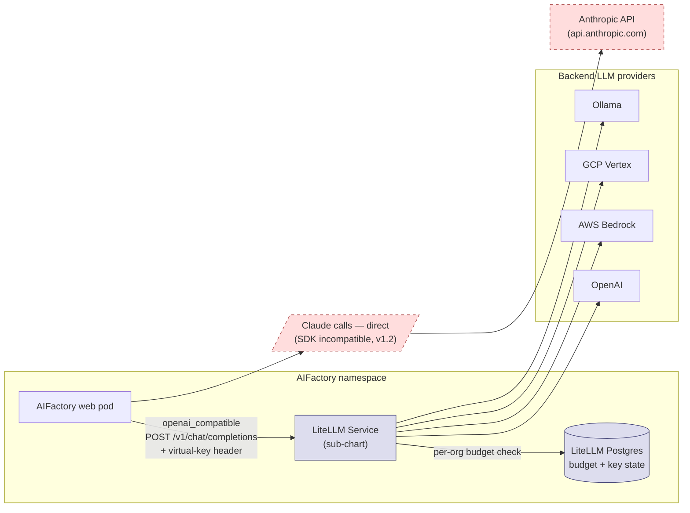

# LiteLLM gateway (Epic #35 #38)

> *Centralised budget, rate-limit, model-allowlist, and audit enforcement for every non-Claude LLM call AIFactory makes. Optional Helm sub-chart that operators flip on with one boolean.*

## When you need this

You want the LiteLLM gateway when **any** of these apply:

- You run **more than one tenant** in a single AIFactory deployment and need per-tenant token budgets (`$500/month`) or rate limits (`60 req/min`).
- Compliance requires a **prompt + response audit log** for SOC2 CC7.2 or ISO 27001 A.12.4.1 evidence beyond the existing chain-audit (`claude.session.*`).
- You want **per-tenant model allowlists** — Org A may use `gpt-4o-mini`, Org B may use `gpt-4o` and `bedrock/anthropic.*`, neither may use models outside their entitlement.
- You route to **Amazon Bedrock or Google Vertex AI** for Claude / Llama / Gemini models (see [Cloud LLM routing](./cloud-llm-routing.md)) — those backends require the gateway as the routing layer.
- You want **per-tenant cost observability** in Grafana without writing your own pricing-table scraper.

You **don't** need it for:

- Laptop installs / single-developer pilots that hit the direct Anthropic API.
- Deployments that use **only Claude** through the Claude Agent SDK — Claude bypasses the gateway in v1.1 (see scope table below).
- Single-tenant deployments where one budget covers everything and no per-org accounting is needed.

## Scope (what flows through, what does not)

| Provider | v1.1 routing | LiteLLM enforcement (budget / rate-limit / allowlist) | Audit coverage |
|----------|-------------|-------------------------------------------------------|----------------|
| Claude (via Claude Agent SDK) | Direct | None | Existing chain audit (`claude.session.start` / `claude.session.end`) signed by the daily anchor (#43) |
| OpenAI / OpenAI-compatible (LM Studio, vLLM, OpenRouter, Together, Groq, LocalAI) | Via gateway | Full | Full (per-call `llm.call` audit row) |
| Codex CLI | Via gateway | Full | Full |
| Gemini | Via gateway | Full | Full |
| Ollama | Via gateway | Full | Full |
| Bedrock | Via gateway | Full | Full (see [Cloud LLM routing](./cloud-llm-routing.md)) |
| Vertex AI | Via gateway | Full | Full (see [Cloud LLM routing](./cloud-llm-routing.md)) |

**The Claude exception.** The Claude Agent SDK spawns the `claude` CLI as a subprocess. That CLI speaks Anthropic-format `POST /v1/messages` which is wire-incompatible with LiteLLM's OpenAI-format `POST /v1/chat/completions`. Pointing `ANTHROPIC_BASE_URL` at the gateway produces a 4xx because the request shape does not match the endpoint. v1.1 leaves Claude calls direct; v1.2 closes the gap via either an in-process Claude-SDK enforcement wrapper in `core/client.py` or a LiteLLM Anthropic-format passthrough endpoint if upstream ships one.

**Compliance implication for Claude calls in v1.1:** Claude calls keep their existing audit-chain coverage (the `claude.session.*` events signed by the daily anchor from #43) but they do NOT get per-tenant budget / rate-limit / allowlist enforcement. Document this explicitly to your compliance team before opting the gateway on; otherwise the residual "Org A's runaway Claude loop costs $10k overnight" risk reads as a regression rather than a known v1.1 limitation.

## Architecture



## Turning it on

The minimum operator configuration:

```yaml
litellm:
  enabled: true
  # K8s Secret with key=LITELLM_MASTER_KEY, value=KMS-wrapped master key.
  masterKeySecretName: aifactory-litellm-master-key

  audit:
    enabled: true
    failureMode: closed    # compliance-safe default

monitoring:
  grafanaDashboards:
    enabled: true   # if you run the Grafana operator; see "Dashboards" below
```

On `helm upgrade`:

1. The LiteLLM sub-chart deploys a Service named `{Release}-litellm` on port 4000 and its own Postgres for budget / virtual-key state.
2. The AIFactory web pod's env grows `LITELLM_GATEWAY_URL` pointing at that Service, plus `LITELLM_MASTER_KEY` mounted from your Secret, plus the four audit knobs (`LITELLM_AUDIT_ENABLED`, `LITELLM_AUDIT_FULL_TEXT`, `LITELLM_AUDIT_FAILURE_MODE`, `LITELLM_AUDIT_EXTRA_PATTERNS`).
3. On next request, the OpenAI-compatible / Codex / Gemini / Ollama / Bedrock / Vertex providers honour `LITELLM_GATEWAY_URL` and route through the gateway. Claude continues direct.
4. The tenant-reconciler (PR-2b code) issues `POST /key/generate` to LiteLLM's admin API for every existing organisation, materialising one virtual key per org with its current `allowed_models` + budget.

### Recipe: in-cluster LiteLLM (sub-chart)

The default when `litellm.enabled=true`. The chart pulls `litellm-helm` from `oci://ghcr.io/berriai/litellm-helm` (currently pinned to `1.86.2`) and deploys it alongside the AIFactory pod. Operators configure backend providers via the standard upstream value paths, nested under the parent chart's `litellm:` block:

```yaml
litellm:
  enabled: true
  masterKeySecretName: aifactory-litellm-master-key

  # Upstream chart values — pass-through.
  proxy_config:
    model_list:
      - model_name: gpt-4o-mini
        litellm_params:
          model: openai/gpt-4o-mini
          api_key: os.environ/OPENAI_API_KEY
      - model_name: bedrock/anthropic.claude-sonnet-4-20250514-v1:0
        litellm_params:
          model: bedrock/anthropic.claude-sonnet-4-20250514-v1:0
          aws_region_name: us-east-1
  environmentSecrets:
    - aifactory-llm-backend-keys
```

### Recipe: external LiteLLM (operator-deployed separately)

Operators with an existing LiteLLM deployment (shared across multiple AIFactory deployments, or run by a neighbouring team) point AIFactory at it without deploying the sub-chart:

```yaml
litellm:
  enabled: true
  masterKeySecretName: aifactory-litellm-master-key
  gatewayUrl: "http://litellm.shared-services.svc.cluster.local:4000"
  # No upstream chart values — the sub-chart is not deployed.
```

When `litellm.gatewayUrl` is set, AIFactory honours it verbatim and the sub-chart Service URL is ignored. The Helm chart still requires `masterKeySecretName` so AIFactory can call the LiteLLM admin API for tenant-reconciler operations.

## Master-key handling

The LiteLLM admin API (used by the tenant-reconciler for `key/generate`, `budget/update`, `key/list`, `key/delete`) requires a master key. AIFactory's threat model treats this key as high-value (its leak gives an attacker full virtual-key control: budget bypass, allowlist bypass, key rotation, key deletion) — same blast radius posture as the audit-anchor signing key from #43.

**Wrap before storing.** The Helm chart's `litellm.masterKeySecretName` MUST reference a Secret containing the **KMS-wrapped** master key, not plaintext. The web-pod's startup unwraps via the configured KMS backend (`crypto/kms/`) on each admin-API call and refuses to call admin APIs without a successful unwrap.

```bash
# Wrap an operator-generated 32-char alphanumeric master key via vault-transit:
RAW="sk-$(openssl rand -hex 16)"
WRAPPED=$(vault write -field=ciphertext transit/encrypt/aifactory-root plaintext=$(echo -n "$RAW" | base64))

kubectl create secret generic aifactory-litellm-master-key \
  --from-literal=LITELLM_MASTER_KEY="$WRAPPED" \
  -n aifactory
```

**Anti-pattern (forbidden):** putting the plaintext master key in the generic `aifactory-config` Secret. The startup validator refuses to call admin APIs without a successful unwrap — the deployment will not function with a plaintext key in that path.

**Rotation runbook.** Same cadence as the audit-anchor signing key documented in #43 (typically annual or post-incident):

1. Operator generates a new master key, wraps via KMS.
2. `kubectl create secret generic aifactory-litellm-master-key-new --from-literal=LITELLM_MASTER_KEY=$WRAPPED_NEW`.
3. Update the LiteLLM deployment's `LITELLM_MASTER_KEY` env to point at the new Secret + restart LiteLLM.
4. Update `litellm.masterKeySecretName` in AIFactory's values + `helm upgrade` to roll the AIFactory pods on the new wrapping.
5. Delete the old Secret after the rollout completes.

Blast radius of a master-key leak: an attacker can rotate / delete / create LiteLLM virtual keys (full budget + allowlist control). They cannot read prompts / responses (LiteLLM does not store those by default in v1.1; `litellm.audit.fullTextCapture=true` writes encrypted full-text rows to AIFactory's own audit_logs, NOT to LiteLLM's Postgres).

## PII redaction (audit-only)

AIFactory's audit hook redacts PII from prompt + response BEFORE writing the audit row. The built-in pattern set:

| Pattern | Replacement | Notes |
|---------|-------------|-------|
| US SSN hyphenated `XXX-XX-XXXX` | `[REDACTED_SSN]` | Bare 9-digit numbers excluded — too many false positives (zip + phone concatenations, code identifiers) |
| Email `user@host.tld` | `[REDACTED_EMAIL]` | |
| US phone `(XXX) XXX-XXXX` or `XXX-XXX-XXXX` | `[REDACTED_PHONE]` | Bare 10-digit numbers excluded for the same reason as SSN |

**The credit-card pattern is intentionally omitted in v1.1.** The naive `\b(?:\d[ -]*?){13,16}\b` matches any 13-16 digit numeric string (IPv4 CIDRs, code identifiers, hashes, etc.) and corrupts legitimate prompt content without Luhn validation. v1.1 omits CC redaction by default; operators with PCI data add Luhn-checked patterns via `litellm.audit.extraRedactionPatterns`. A built-in Luhn-validated CC pattern ships in v1.2.

Operator additions:

```yaml
litellm:
  audit:
    extraRedactionPatterns:
      - pattern: 'ACC-\d{8}'         # internal account number
        replacement: '[REDACTED_ACCT]'
      - pattern: '\b4\d{15}\b'       # Visa, no spaces — Luhn-check yourself
        replacement: '[REDACTED_CC]'
```

Patterns are Python `re` syntax. Compile failures log WARNING + skip the bad pattern (fail-safe; one bad regex does not disable all redaction).

**Scope discipline: redaction applies to the audit row ONLY, NOT to what the LLM sees.** A high-sensitivity tenant whose prompt contains PII still sends that PII to the LLM provider — this is intrinsic to LLM use today. The threat-model entry in the design doc makes this explicit. v1.2 ships a `litellm.audit.scrubBeforeSend` mode that applies the same redactor to the prompt BEFORE the LLM call, at the cost of some prompt-quality degradation. Get compliance sign-off on the v1.1 scope (audit-only) before enabling.

## Audit shape

Every LLM call produces an `audit_logs` row with `classification='confidential'` (per #43 three-tier classification). Three action variants cover the lifecycle:

| `action` | When fired | Notes |
|----------|------------|-------|
| `llm.call` | Successful response completion (the assembled final message) | The happy path. Audit row includes `input_tokens`, `output_tokens`, `cost_usd`, `latency_ms`, truncated prompt + response, `litellm_request_id` |
| `llm.call.abandoned` | Client disconnect / timeout / task cancellation mid-stream | The provider catches `asyncio.CancelledError` in `receive_response()` and writes a row with whatever partial token-count it has + `truncated: true` |
| `llm.call.failed` | Provider-side 5xx mid-stream or pre-stream | Catch-block writes a row with the error |

**Result: 100% of LLM-call attempts produce an audit row of some shape.** No abandonment / failure leaves a silent gap.

Row body:

```json
{
  "id": "<uuid>",
  "org_id": "<org-uuid>",
  "user_id": "<user-uuid or 'agent'>",
  "action": "llm.call",
  "resource_type": "llm",
  "resource_id": "<model-name>",
  "classification": "confidential",
  "details_json": {
    "model": "gpt-4o-mini",
    "input_tokens": 1200,
    "output_tokens": 450,
    "cost_usd": 0.0234,
    "cost_source": "litellm_estimate",
    "latency_ms": 1847,
    "prompt_truncated": "...first 4KB after PII redaction...",
    "response_truncated": "...first 4KB after PII redaction...",
    "litellm_request_id": "<for cross-reference with LiteLLM logs>"
  }
}
```

Default bound: ~10KB per row. Operators wanting full prompt / response storage opt in via `litellm.audit.fullTextCapture=true`, which switches to the encrypted-rows path (full text via the `EncryptedString` column type from Epic #26 P2).

**Cost accuracy caveat.** `cost_usd` is a LiteLLM estimate from its internal pricing table, which lags provider price changes by days / weeks. The audit row carries `cost_source: "litellm_estimate"` so chargeback queries can distinguish "approximate" (LiteLLM estimate) from "authoritative" (provider invoices). Use the estimate for soft per-tenant chargeback, not for legal cost-allocation.

## Per-org allowlist

`organizations.allowed_models` (JSONB column, default `["*"]` for backward compat — all models allowed when isolation isn't configured) gates which models each org can use through the gateway:

```sql
-- Default behaviour: all models allowed
SELECT id, name, allowed_models FROM organizations;
-- → ["*"]  for orgs that haven't been restricted

-- Production tightening: per-tier allowlists
UPDATE organizations SET allowed_models = '["claude-*"]'              WHERE tier = 'enterprise';
UPDATE organizations SET allowed_models = '["gpt-4o-mini", "gpt-4o"]' WHERE tier = 'team';
```

On Organization create / update, the tenant-reconciler calls LiteLLM's admin API to update the per-org virtual key's `models` field. LiteLLM rejects requests for non-allowed models with HTTP 400, which the provider class re-raises as `ModelNotAllowedError` (typed; surfaces in agent error logs and on the Virtual-key rejection rate Grafana panel).

**Backward compatibility:** existing orgs without an explicit allowlist keep `["*"]` and behave exactly as pre-#38. No migration is required for existing tenants.

## Failure modes — fail-closed default, fail-open opt-in

When the audit-write path fails (KMS down, DB unreachable, PII regex compile error, etc), the operator chooses what happens:

| `failureMode` | Behaviour | When to use |
|---------------|-----------|-------------|
| `closed` (default) | Reject the LLM call with `LiteLLMAuditFailureError`. Compliance-safe — every accepted LLM call has a corresponding audit row | Production. The whole point of the gateway is the audit evidence; bypassing on failure defeats the purpose |
| `open` | Let the call through with a logged WARNING + a metric increment (`aifactory_litellm_audit_failures_total{failure_mode="open"}`) | During-incident escape hatch for triage (e.g. KMS outage where you'd rather continue serving than block all LLM traffic). Documented as a compliance regression — log the operator-decision context in the incident ticket |

The trade-off: `closed` is what auditors want to see in your security policy; `open` is what your operators want at 03:00 UTC when KMS is down and a tier-1 customer is screaming. Pick `closed` as the deployment default, document the runbook for switching to `open` mid-incident, and review every `open`-mode session as part of the post-incident review.

## Circuit breaker for transient errors

Pure fail-closed-on-every-error would cancel every in-flight agent task during a 10-second LiteLLM pod reschedule. The provider wraps LiteLLM calls in a 3-retry exponential backoff (100ms / 200ms / 400ms — total worst-case 700ms before failing the task). Transient errors (single-pod restart, brief DNS flap) recover silently; sustained outages fail the task with `LiteLLMGatewayUnavailableError` and an operator-actionable message.

Operators alert on `litellm_up == 0` for the longer-term outage case (sustained > 60s). Documented in the design doc §8.

## Virtual-key lifecycle

The tenant-reconciler (PR-2b) syncs AIFactory organisation state to LiteLLM virtual keys on every reconcile tick:

| Trigger | Reconciler action |
|---------|-------------------|
| Org create | `POST /key/generate` with the org's `allowed_models` + budget |
| Org soft-delete (e.g. trial expired, billing on hold) | `PUT /key/update` with `budget_duration=0` (immediate block; audit row records the disable) |
| Org hard-delete (day 30 after soft-delete, per #36 lifecycle) | `DELETE /key/delete` |
| Drift recovery (LiteLLM DB restored from backup, AIFactory + LiteLLM out of sync) | Periodic reconcile-all sweep compares AIFactory org state to LiteLLM via `/key/list`; creates missing, revokes orphans |

All four operations write an `audit_logs` row with `action='litellm.key.*'` (e.g. `litellm.key.created`, `litellm.key.disabled`, `litellm.key.deleted`) — operators see the full lifecycle in the audit log.

## Dashboards

`charts/aifactory/dashboards/litellm.json` ships six panels backed by Prometheus metrics from LiteLLM's exporter:

| Panel | Metric source | What to watch for |
|-------|---------------|-------------------|
| LLM call rate (per model) | `rate(litellm_requests_total{model=~"$model"}[5m])` | Sudden spike per org → runaway-loop signal |
| Per-org cost (last 24h) | `increase(litellm_total_spend{user=~"$org_id"}[24h])` | Daily budget headroom per tenant |
| P95 latency by model | `histogram_quantile(0.95, ...)` on `litellm_request_latency_seconds_bucket` | Sustained > 5s → backend degradation or retry budget hit |
| Audit-hook failure rate | `rate(aifactory_litellm_audit_failures_total[5m])` | Non-zero in fail-open mode = active compliance gap |
| PII-redaction pattern hit rate | `rate(aifactory_litellm_pii_redaction_hits_total[5m])` | Confirms built-in + operator patterns fire in production |
| Virtual-key rejection rate | `rate(litellm_request_denied_total{denial_reason="model_not_allowed"}[5m])` | Sustained non-zero = org trying models outside their allowlist |

Two template variables: `org_id` (multi-select from LiteLLM's `user` label) and `model` (multi-select from `model` label). Set both to `All` for deployment-wide view; scope down for per-tenant investigation.

**Operator install paths:**

- **Grafana operator (recommended):** flip `monitoring.grafanaDashboards.enabled=true` in values. The chart renders a ConfigMap with the `grafana_dashboard: "1"` label that the operator's sidecar auto-discovers.
- **Vanilla Grafana / Grafana Cloud:** leave the toggle off and import `charts/aifactory/dashboards/litellm.json` via the Grafana UI → Dashboards → Import.

## Version pin + bump cadence

The Helm chart pins `litellm-helm` to a specific 1.x.y version (currently `1.86.2`). Bump policy:

| Bump type | Example | Process |
|-----------|---------|---------|
| PATCH | `1.86.2 → 1.86.3` | Tracked by renovate; auto-mergeable after CI passes (helm dep update + helm template + helm lint + helm test) |
| MINOR | `1.86.x → 1.87.x` | Manual review. Upstream sometimes ships breaking values.yaml schema changes in minor versions; never auto-merge. A staging-cluster test against the budget + allowlist admin API gates the merge |
| MAJOR | `1.x → 2.x` | Full re-evaluation of the design — admin API shape may shift, virtual-key migration may be required, dashboard metrics names may change |

The same policy applies whether you run the in-cluster sub-chart or an external LiteLLM. For external LiteLLM, you're responsible for keeping it on a compatible version range (check upstream release notes for breaking changes to `/key/generate`, `/key/list`, `/spend/user` admin endpoints).

## Operator runbook

### First install

```bash
# 1. Provision the wrapped master-key Secret (see §Master-key handling).
kubectl create secret generic aifactory-litellm-master-key \
  --from-literal=LITELLM_MASTER_KEY="$KMS_WRAPPED_KEY" \
  -n aifactory

# 2. Update your values.yaml with the litellm: + monitoring: blocks above.
# 3. Helm dep update + upgrade.
helm dep update charts/aifactory/
helm upgrade --install aifactory charts/aifactory/ -n aifactory -f your-values.yaml

# 4. Verify the sub-chart's Service is up.
kubectl get svc -n aifactory | grep litellm
# → aifactory-litellm   ClusterIP   ...   4000/TCP

# 5. Verify the AIFactory pod sees the gateway URL.
kubectl exec -n aifactory deploy/aifactory -- printenv | grep LITELLM_GATEWAY_URL
# → LITELLM_GATEWAY_URL=http://aifactory-litellm.aifactory.svc.cluster.local:4000

# 6. (After PR-2b ships) Verify the tenant-reconciler has materialised virtual keys.
kubectl exec -n aifactory deploy/aifactory -- curl -s \
  -H "Authorization: Bearer $LITELLM_MASTER_KEY" \
  http://aifactory-litellm:4000/key/list | jq '.keys | length'
```

### Configure first backend (OpenAI example)

```yaml
# values.yaml
litellm:
  enabled: true
  masterKeySecretName: aifactory-litellm-master-key

  proxy_config:
    model_list:
      - model_name: gpt-4o-mini
        litellm_params:
          model: openai/gpt-4o-mini
          api_key: os.environ/OPENAI_API_KEY
  environmentSecrets:
    - aifactory-llm-backend-keys   # K8s Secret with OPENAI_API_KEY key
```

### Verify audit_logs writes

```bash
# After kicking off a test LLM call from the AIFactory UI, query Postgres.
psql $DATABASE_URL -c "
  SELECT action, resource_id, details_json->>'cost_source', classification
  FROM audit_logs
  WHERE action LIKE 'llm.%'
  ORDER BY created_at DESC LIMIT 5;
"
# Expected: rows with action='llm.call', cost_source='litellm_estimate',
#           classification='confidential'.
```

### Troubleshoot allowlist rejections

```bash
# An end-user reports "Model not allowed" errors.

# 1. Check what models the org's virtual key permits.
kubectl exec -n aifactory deploy/aifactory -- curl -s \
  -H "Authorization: Bearer $LITELLM_MASTER_KEY" \
  http://aifactory-litellm:4000/key/info?key=sk-org-abc... | jq .models

# 2. Check what allowed_models the org has in the AIFactory DB.
psql $DATABASE_URL -c "
  SELECT id, name, allowed_models FROM organizations WHERE id = '<org-uuid>';
"

# 3. If they differ → reconciler drift. Force a reconcile.
kubectl exec -n aifactory deploy/aifactory -- python -m server.jobs.tenant_reconciler --org <org-uuid>
```

## See also

- [Cloud LLM routing (Bedrock + Vertex)](./cloud-llm-routing.md) — how Bedrock / Vertex traffic flows through this gateway (Epic #35 #39).
- [Signed audit-chain anchor](./audit-anchor.md) — the daily HMAC signing pass that LLM-call audit rows feed into (Epic #35 #43).
- [Multi-replica deployment](./multi-replica.md) — Redis-backed cross-replica WebSocket fan-out (Epic #35 #40).
- Design doc in-repo: `docs/plans/2026-05-28-litellm-gateway-design.md`.
- [GitHub issue #38](https://github.com/olafkfreund/AIFactory/issues/38) — original design + audit.
- Upstream [LiteLLM Helm chart](https://github.com/BerriAI/litellm/tree/main/deploy/charts/litellm-helm) — for pass-through values reference.
