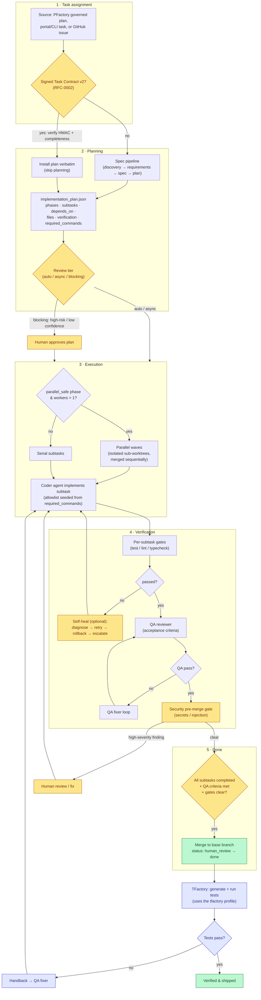

# Pipeline Flow

This is the canonical flow of a single unit of work: how it is **assigned**,
**planned**, **executed**, and **verified**, and exactly when we call it
**done**. It spans the PARR pipeline — **P**lan (PFactory), **A**ct
(AIFactory), **R**eview/verify (TFactory), all observed by CFactory — but
focuses on AIFactory's role and its handoffs.

## The flow

## What each stage means

1. **Task assignment.** Work enters from PFactory (a governed, signed plan), the
   portal/CLI, or a GitHub issue. If it carries a **signed Task Contract v2**
   (RFC-0002), AIFactory verifies the HMAC signature + completeness and installs
   the plan directly — *skipping its own planning*. Otherwise it runs the spec
   pipeline.
2. **Planning.** Produces `implementation_plan.json`: phases and subtasks with
   `depends_on`, file footprints, per-subtask `verification`, and the
   `required_commands` toolchain. A **review tier** is assigned — `auto`,
   `async`, or `blocking` — based on risk (auth/secrets/migrations/infra) and
   planner confidence.
3. **Execution.** Independent subtasks run as **parallel waves** in isolated
   sub-worktrees (merged sequentially) when the phase is `parallel_safe` and
   workers > 1; otherwise serially. The coder agent's command allowlist is
   seeded from the plan so it can verify its own work.
4. **Verification.** Each subtask runs its **gates** (test/lint/typecheck). With
   self-heal enabled, a failure triggers diagnose → bounded retry → rollback →
   escalate. Then the **QA reviewer** checks acceptance criteria (with a bounded
   QA-fixer loop), and a **security pre-merge gate** scans the diff.

## Definition of done

A unit is **done** only when *all* of these hold:

- **Every subtask is `completed`** in `implementation_plan.json` (no `pending`,
  `failed`, or orphaned work).
- **QA acceptance criteria pass** — the QA reviewer signs off (`qa_signoff`).
- **All gates are clear** — per-subtask verification passed, and the security
  pre-merge gate found nothing at/above the block threshold.
- **The review tier is satisfied** — any required human approval (blocking tier
  / high-risk paths) has been given.

At that point the branch merges to base and the task moves `human_review → done`.
**Shipped-and-verified** is the stronger bar: TFactory then generates and runs
tests from the contract's `tfactory` profile; only when those pass is the work
fully verified. Test failures hand back to the QA fixer (a bounded loop), never
silently.

## Why it is this way

- **Gates, not vibes.** "Done" is defined by *checks that ran* — subtask
  verification, QA criteria, security scan — not by an agent declaring success.
  Each gate is independent and auditable.
- **Skip planning when it's already been done.** PFactory does the governed
  analysis once; re-planning it in AIFactory wastes time and drifts. The signed
  contract lets AIFactory trust *and verify* that work and go straight to building.
- **Risk decides how much human is in the loop.** Trivial/trusted work flows
  `auto`; most work is `async` (humans comment without halting the agent);
  high-risk work *blocks* before code and before merge. The cost of review is
  paid where the risk is.
- **Parallelism without losing auditability.** Independent subtasks run
  concurrently in isolated worktrees and merge sequentially, so speed never
  costs a coherent, reviewable history.
- **Self-healing is bounded.** Retry/rollback is capped and checkpoint-backed;
  on exhaustion it escalates to a human rather than thrashing. Security and
  destructive triggers escalate immediately.

See also: [Task Lifecycle](../task-lifecycle.md) (every option/variable) and
[Task Contract v2](../task-contract.md) (the signed handoff).
