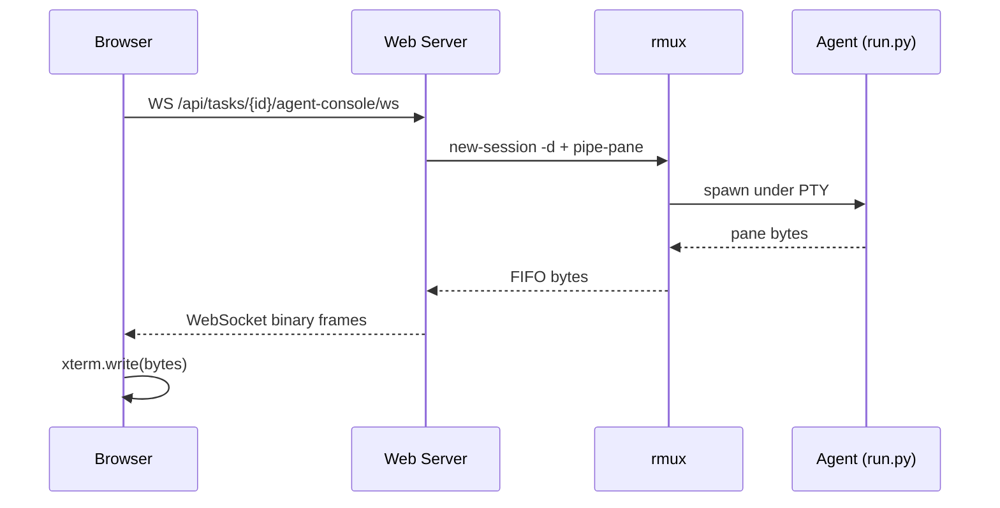

# rmux Live Agent Console

The Live Console gives you a real-time view into the agent process — its terminal output, its file edits, its tool calls — streamed straight from the agent's pseudo-TTY into a browser xterm canvas.

## How it works

When a task starts, the backend spawns the agent inside an **rmux session** (rmux is a tmux-fork in Rust we bundle in the enterprise build). rmux pipes the session's pane bytes to a FIFO. The web-server reads the FIFO and forwards bytes over a WebSocket to the React client, which writes them to xterm.

You see exactly what the agent sees — including thinking traces and the `claude` CLI's progress indicators.



## Two modes

- **Read-only** (default) — you watch. The session has no input bound.
- **Attached** — you click **Attach**, confirm the takeover dialog, and your keystrokes go straight to the agent's stdin. Only one client can hold Attach at a time; others see a 409 if they try.

## Enabling it

The Live Console is **opt-in**. Turn it on either way (either flips it on):

```bash
# Web-server setting — the idiomatic way for local dev (apps/web-server/.env).
# It's a validated APP_-prefixed setting, so it won't trip pydantic config.
APP_RMUX_ENABLED=true

# Or the raw process env var — works in any context (e.g. the agent runner).
AIFACTORY_RMUX_ENABLED=true
```

When neither is set, the backend's behavior is byte-for-byte unchanged — the rmux integration shim is a no-op, and the portal hides the Live Console tab.

You also need the `rmux` binary on PATH. The Helm chart bundles it under a separate image tag (`:vX-rmux`). If the binary is missing, tasks fall back to the normal PTY path safely (no crash) — you just don't get the live stream.

The console appears both as a tab in the task-detail view and embedded in the [Mission Control workspace](./mission-control-workspace).

## Multi-agent console grid

When several tasks run in the same project, you can watch all their consoles at
once:

```
/console/:projectId
```

This renders a responsive grid — one tile per active agent — with a live "N
active" count, a per-tile fullscreen control, and real-time streaming from every
agent. Reach it from the "All consoles" link on any single console header or the
badge in task detail. It's the view to keep open when monitoring a parallel-wave
build or a batch of tasks.

## Why it's not on by default

rmux v0.3.x requires a writable runtime directory and pins replicas to 1. Bank-pilot deployments where these constraints break the existing infra opt out by leaving the flag unset.

## Status

Shipping incrementally in PRs #67–#71 (Epic #44). Currently in dev branch. The portal hides the Live Console tab automatically when the feature is off (`APP_RMUX_ENABLED` / `AIFACTORY_RMUX_ENABLED` unset), probing `GET /api/capabilities` on load.
