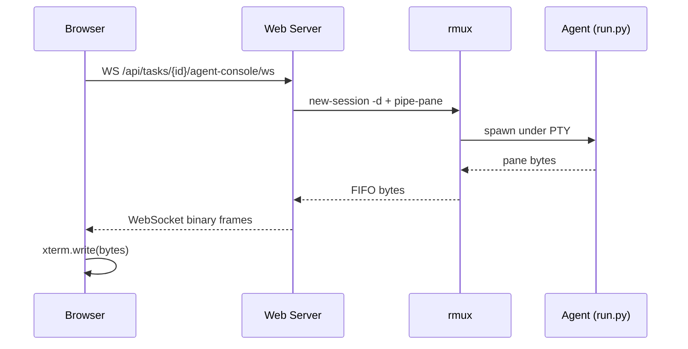

# rmux Live Agent Console

The Live Console gives you a real-time view into the agent process — its terminal output, its file edits, its tool calls — streamed straight from the agent's pseudo-TTY into a browser xterm canvas.

## How it works

When a task starts, the backend spawns the agent inside an **rmux session** (rmux is a tmux-fork in Rust we bundle in the enterprise build). rmux pipes the session's pane bytes to a FIFO. The web-server reads the FIFO and forwards bytes over a WebSocket to the React client, which writes them to xterm.

You see exactly what the agent sees — including thinking traces and the `claude` CLI's progress indicators.



## Two modes

- **Read-only** (default) — you watch. The session has no input bound.
- **Attached** — you click **Attach**, confirm the takeover dialog, and your keystrokes go straight to the agent's stdin. Only one client can hold Attach at a time; others see a 409 if they try.

## Enabling it

The Live Console is **opt-in** via env flag:

```bash
AIFACTORY_RMUX_ENABLED=true
```

When the flag is unset, the backend's behavior is byte-for-byte unchanged — the rmux integration shim is a no-op.

You also need the `rmux` binary on PATH. The Helm chart bundles it under a separate image tag (`:vX-rmux`).

## Why it's not on by default

rmux v0.3.x requires a writable runtime directory and pins replicas to 1. Bank-pilot deployments where these constraints break the existing infra opt out by leaving the flag unset.

## Status

Shipping incrementally in PRs #67–#71 (Epic #44). Currently in dev branch. The portal hides the Live Console tab automatically when `AIFACTORY_RMUX_ENABLED` is off.
