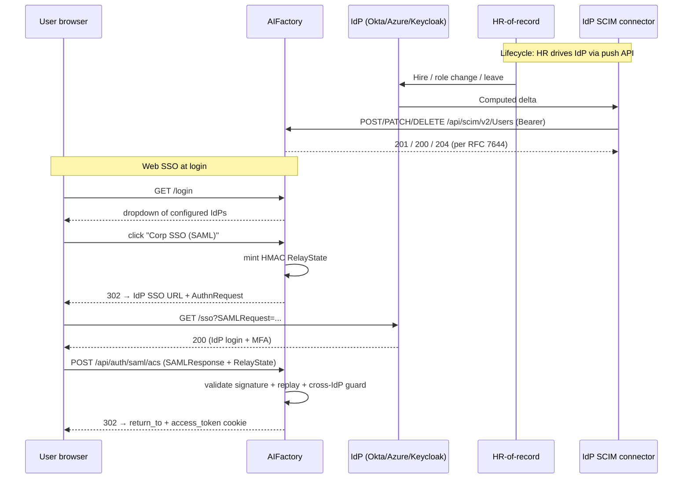

# SAML 2.0 SSO + SCIM 2.0 provisioning (Epic #35 #41)

> *Web SSO for ADFS-era IdPs alongside automated user lifecycle from your HR-of-record. Ship into regulated banks whose identity team mandates SAML + SCIM instead of OIDC.*

## When you need this

You want the SAML + SCIM stack when **any** of these apply:

- Your prospect's identity team mandates **SAML 2.0 Web SSO** — typical for regulated banks, ADFS-era enterprises, EU public-sector tenders.
- Your prospect's HR-of-record (Workday / SuccessFactors / BambooHR) syncs into the IdP and the IdP needs to push joiners / leavers / role changes to AIFactory automatically.
- A compliance team needs cryptographic evidence that **HR offboard within 1 hour → AIFactory account disabled within 1 hour** without a human in the loop.

You **don't** need it for:

- Okta / Auth0 / Google / GitHub deployments — the existing OIDC stack covers these.
- Single-tenant / small-team deployments where a human adds accounts.
- Laptop installs / dev sessions.

## What's in scope (and what's not)

| Aspect | v1.1 status |
|--------|-------------|
| SAML 2.0 Web SSO (SP-init + IdP-init) | ✅ |
| `python3-saml` (OneLogin) wrapper with hard-coded XSW / strict defences | ✅ |
| SP signing cert + optional encrypted-assertion decryption | ✅ |
| IdP federation-metadata refresh (4-hour periodic, 48-hour stale-warn) | ✅ |
| SCIM 2.0 full CRUD on Users + Groups (POST / GET / PATCH / PUT / DELETE) | ✅ |
| SCIM soft-delete + 404-on-GET (Azure AD sync compat) | ✅ |
| SCIM filter subset: `eq` on `userName` / `externalId` / `active` | ✅ |
| Per-assertion-TTL replay defence (not blanket 5-min LRU) | ✅ |
| HMAC-signed RelayState (SP-init CSRF defence) | ✅ |
| Cross-IdP collision guard (OIDC ↔ SAML auto-link rejection) | ✅ |
| Login-page IdP discovery dropdown | ✅ |
| SAML Single Logout (SLO) | ❌ (decision #11 — local logout only) |
| Per-tenant SAML IdP routing | ❌ (v1.2, ships with #36 tenant isolation) |
| Just-in-time provisioning via SAML alone (no SCIM) | ❌ (decision #4 — SCIM provisions first) |
| OAuth client-credentials grant for SCIM | ❌ (decision #3 — static Bearer in v1.1) |
| FedRAMP / FIPS-mode crypto enforcement | ❌ (operator picks PEM; we don't enforce FIPS) |

## How it fits together



## Helm values reference

```yaml
saml:
  enabled: true
  spEntityId: "https://aifactory.example.com/saml"
  acsUrl: "https://aifactory.example.com/api/auth/saml/acs"
  idpMetadataUrl: "https://idp.example.com/saml/metadata"
  # ─── OR, for air-gapped envs ───
  # idpMetadataSecretName: "aifactory-saml-idp"
  idpName: "corp-sso"
  idpDisplayName: "Corp SSO (SAML)"
  spCertSecretName: "aifactory-saml-sp"   # optional unless requireEncryptedAssertion
  requireEncryptedAssertion: false
  idpInitDefaultReturnTo: "https://aifactory.example.com/"

scim:
  enabled: true
  tokenSecretName: "aifactory-scim"       # Secret with key SCIM_BEARER_TOKEN
```

The `helm install` step validates four constraints up front so you never have a pod that crashloops on misconfiguration:

| Validator | What it catches |
|-----------|-----------------|
| `saml.enabled=true` requires `spEntityId` + `acsUrl` | Forgetting the SP identity. |
| `saml.enabled=true` requires exactly ONE of `idpMetadataUrl` / `idpMetadataSecretName` | Either no metadata source, or both (ambiguous). |
| `saml.requireEncryptedAssertion=true` requires `saml.enabled=true` | Encryption requirement without SAML being on is a typo. |
| `saml.requireEncryptedAssertion=true` requires `spCertSecretName` | Can't decrypt without the SP private key. |
| `scim.enabled=true` requires `scim.tokenSecretName` | SCIM exposed without auth = bad day. |

## IdP preset recipes

### Okta

1. In the Okta admin console, **Applications → Add Application → SAML 2.0**. Set:
   - Single sign on URL: `https://aifactory.example.com/api/auth/saml/acs`
   - Audience URI (SP Entity ID): `https://aifactory.example.com/saml`
   - Name ID format: `EmailAddress`
   - Application username: `Email`
2. **Applications → AIFactory → Provisioning → Configure API integration → Enable**. SCIM 2.0 base URL: `https://aifactory.example.com/api/scim/v2`. Authentication mode: `HTTP Header`. Header value: `Bearer <SCIM_BEARER_TOKEN>`.
3. Download the IdP metadata URL from Okta's app sign-on tab.

```yaml
saml:
  enabled: true
  spEntityId: "https://aifactory.example.com/saml"
  acsUrl: "https://aifactory.example.com/api/auth/saml/acs"
  idpMetadataUrl: "https://yourorg.okta.com/app/<app-id>/sso/saml/metadata"
  idpName: "okta"
  idpDisplayName: "Okta"
scim:
  enabled: true
  tokenSecretName: "aifactory-scim"
```

Vendor docs: [Okta SAML setup](https://developer.okta.com/docs/concepts/saml/) · [Okta SCIM provisioning](https://developer.okta.com/docs/guides/scim-with-okta-integration-network/).

### Azure AD (Microsoft Entra ID)

1. **Enterprise applications → New application → Create your own application → Non-gallery**.
2. **Single sign-on → SAML**:
   - Identifier (Entity ID): `https://aifactory.example.com/saml`
   - Reply URL (ACS URL): `https://aifactory.example.com/api/auth/saml/acs`
   - User Identifier (NameID): `user.mail`
3. Download the **App Federation Metadata URL** from the SAML signing certificate panel.
4. **Provisioning → Automatic**. Tenant URL: `https://aifactory.example.com/api/scim/v2`. Secret Token: `<SCIM_BEARER_TOKEN>`.

```yaml
saml:
  enabled: true
  spEntityId: "https://aifactory.example.com/saml"
  acsUrl: "https://aifactory.example.com/api/auth/saml/acs"
  idpMetadataUrl: "https://login.microsoftonline.com/<tenant-id>/federationmetadata/2007-06/federationmetadata.xml?appid=<app-id>"
  idpName: "azure-ad"
  idpDisplayName: "Microsoft Entra ID"
scim:
  enabled: true
  tokenSecretName: "aifactory-scim"
```

Vendor docs: [Entra ID SAML tutorial](https://learn.microsoft.com/en-us/entra/identity-platform/single-sign-on-saml-protocol) · [Entra ID SCIM provisioning](https://learn.microsoft.com/en-us/entra/identity/app-provisioning/use-scim-to-provision-users-and-groups).

### Keycloak

1. **Realm Settings → Clients → Create client**. Client type: `SAML`. Client ID: `https://aifactory.example.com/saml`.
2. **Settings**:
   - Valid redirect URIs: `https://aifactory.example.com/api/auth/saml/acs`
   - Master SAML Processing URL: `https://aifactory.example.com/api/auth/saml/acs`
   - Name ID Format: `email`
   - Sign Assertions: `On` (must match our `wantAssertionsSigned=True`)
3. **Realm Settings → SAML 2.0 Identity Provider Metadata**: this URL is what AIFactory's `idpMetadataUrl` points at.
4. Keycloak does not ship a SCIM connector out of the box. Use a third-party Keycloak extension (e.g. `keycloak-scim`) or write user-sync via the Keycloak admin REST API into AIFactory's `/api/scim/v2`.

```yaml
saml:
  enabled: true
  spEntityId: "https://aifactory.example.com/saml"
  acsUrl: "https://aifactory.example.com/api/auth/saml/acs"
  idpMetadataUrl: "https://keycloak.example.com/realms/corp/protocol/saml/descriptor"
  idpName: "keycloak"
  idpDisplayName: "Corp Keycloak"
```

> Keycloak emits IdP-init flows without the `InResponseTo` attribute on the `<Response>`. Our SDK wrapper accepts this case (treats as IdP-init and lands on `idpInitDefaultReturnTo`) — see the test matrix.

Vendor docs: [Keycloak SAML server docs](https://www.keycloak.org/docs/latest/server_admin/index.html#_saml).

## Failure-safe contract

Same as the OTel stack (#42) and the audit anchor (#43): every SAML / SCIM code path wraps in `try/except`. A broken IdP **does not** crash the portal:

- IdP metadata fetch fails on startup → pod boots; the next login attempt logs a clear "SAML enabled but metadata not loaded" error and returns 503. Existing OIDC users keep logging in.
- IdP metadata stale > 48 hours → WARNING on every login attempt (operators wire to their alerting) but the cached metadata keeps serving logins until it actually expires.
- Malformed SCIM request → typed RFC 7644 §3.12 SCIM error response, not a generic 500.
- Replay attack (same assertion submitted twice within its `NotOnOrAfter` window) → 400 with a generic rejection message; replay-cache eviction is per-assertion-TTL, not a blanket 5-minute LRU (which would let an Azure AD assertion be replayed after 5 minutes for the rest of its 60–120 minute life).

## Operator runbooks

### SP cert rotation

The SP signing cert is what the IdP uses to verify our `AuthnRequest` signatures (and what we use to decrypt assertions when `requireEncryptedAssertion=true`). Rotation has a small overlap window so the IdP keeps trusting us while it ingests the new metadata:

1. Generate new keypair: `openssl req -x509 -newkey rsa:2048 -keyout new-key.pem -out new-cert.pem -days 365 -nodes -subj "/CN=aifactory.example.com"`.
2. Add to the Secret as a rotation overlap:
   ```bash
   kubectl get secret aifactory-saml-sp -o json | jq \
     --rawfile new_cert new-cert.pem \
     --rawfile new_key new-key.pem \
     --rawfile prev_cert <(kubectl get secret aifactory-saml-sp -o jsonpath='{.data.cert\.pem}' | base64 -d) \
     '.data["cert.pem"] = ($new_cert | @base64) | .data["key.pem"] = ($new_key | @base64) | .data["cert.pem.previous"] = ($prev_cert | @base64)' \
     | kubectl apply -f -
   ```
3. `kubectl rollout restart deployment/aifactory` — pod picks up new key for signing, old cert stays in `x509certMulti` for decryption.
4. Fetch updated SP metadata from `/api/auth/saml/metadata`, upload to the IdP, wait for IdP-side propagation (Okta ≈ 5 min, Azure AD ≈ 15 min).
5. Drop `cert.pem.previous` from the Secret + `rollout restart` again.

### IdP metadata refresh cadence

| Source | Refresh behaviour |
|--------|-------------------|
| `idpMetadataUrl` | Background task refreshes every **4 hours** with exponential backoff on failure (1 min → 2 min → 4 min → ... → 1 hour cap). |
| `idpMetadataSecretName` | No automatic refresh — rotate by recreating the Secret + pod restart. |

If the cached metadata exceeds **48 hours** without a successful refresh, the next login attempt logs a `WARNING` (operators wire to their alerting). Logins still succeed against the cached metadata until it actually expires at the IdP.

### SCIM token rotation

```bash
NEW_TOKEN=$(openssl rand -base64 48 | tr -d '\n=' | head -c 48)
kubectl create secret generic aifactory-scim \
  --from-literal=SCIM_BEARER_TOKEN="$NEW_TOKEN" \
  --dry-run=client -o yaml | kubectl apply -f -
kubectl rollout restart deployment/aifactory
# Paste $NEW_TOKEN into the IdP's SCIM connector config.
```

The token is read once at startup; the constant-time compare protects against a timing oracle. The `maxSurge: 1` rolling-update setting gives zero-downtime rotation (the new pod starts and reads the new token; the old pod stays up serving the old token until the new pod is ready, then drains).

### Logout

> **Local logout only.** AIFactory's "Sign out" clears our session cookie and redirects to the login page. We do **not** issue a SAML `LogoutRequest` to the IdP.

If the IdP is the system of record for "is this human at work right now", configure short access-token TTLs (default 30 min) and rely on the IdP's session-kill admin console for force-logout scenarios. Some compliance auditors specifically ask whether we do SLO — the answer is "no, by design, in v1.1". v1.2 may revisit if there's actual demand.

## SCIM specifics (RFC 7644 deviations + caveats)

### Filter grammar subset

We support a deliberately minimal subset of [RFC 7644 §3.4.2](https://www.rfc-editor.org/rfc/rfc7644#section-3.4.2):

- Attributes: `userName`, `externalId`, `active`
- Operators: `eq` only
- No bracket grouping, no `and` / `or`

Examples that work:
```
?filter=userName eq "alice@corp.com"
?filter=externalId eq "okta-12345"
?filter=active eq false
```

Examples that return `400 {scimType: "invalidFilter"}`:
```
?filter=userName co "alice"           # operator not supported
?filter=userName eq "x" and active eq true   # boolean not supported
?filter=(active eq true)              # grouping not supported
```

This covers 100% of what Okta + Azure AD send during user-sync. Other IdPs that issue richer filters fall back to client-side filtering on a paged list.

### Soft-delete + 404-on-GET

`DELETE /scim/v2/Users/{id}` sets `active=false` and preserves the row for audit-log integrity. Subsequent `GET /scim/v2/Users/{id}` returns `404` — Azure AD re-GETs after DELETE and treats a 200 as "user is still here, retry deprovisioning forever". The row is reachable only via the admin tooling, not via SCIM.

### Multi-valued PATCH semantics

`op: add` on a multi-valued attribute (e.g. Group `members`) **appends** to the existing array. Implementing it as replace is the most common SCIM bug; Azure AD relies on the append semantics for Group member sync. The PATCH applier in `apps/web-server/server/scim/filters.py` has dedicated array handling.

### Identity-key constraint (v1.1)

```
scim.userName == saml.NameID == users.email
```

SCIM's `userName` and SAML's `NameID` **must** both be the user's email. The provisioning layer enforces this on `POST /scim/v2/Users`: if `userName != emails[0].value`, the response is `400 {scimType: "invalidValue"}`. Operators who need decoupled `userName` (e.g. `alice.smith` for `userName`, `alice@corp.com` for `email`) wait for v1.2.

### Cross-IdP collision guard

If a User row already has an OIDC identity (`external_identities.kind = 'oidc:github'`), the first SAML login for that email returns `409` with:

> Cross-IdP linkage requires admin confirmation. Contact your AIFactory administrator to link this identity.

This closes the hijack-via-unverified-email attack: an attacker who controls a GitHub account that doesn't verify corporate email could otherwise link via OIDC, then have a corp SAML IdP silently re-bind the same User row. v1.1 lands the safe-default block; v1.2 adds the admin UI for the legitimate link-multiple-IdPs case (today the admin runbook is to verify the human identity and update `external_identities` in the DB).

## Trust scope (what this defends + what it doesn't)

| Threat | Defended? |
|--------|-----------|
| Unsigned `<Assertion>` (signed-Response-only IdP) | ✅ `wantAssertionsSigned=True` rejects |
| XML Signature Wrapping (XSW) | ✅ `strict=True` hard-coded, never operator-configurable |
| Replay of captured assertion within its `NotOnOrAfter` window | ✅ Per-assertion-TTL replay cache |
| SP-init CSRF (attacker triggers `/saml/login` then steals the assertion) | ✅ HMAC-signed RelayState |
| Open-redirect via IdP-init `return_to` | ✅ Validator enforces scheme + host match `spEntityId` |
| Cross-IdP email hijack (OIDC-linked GitHub account + corp SAML email) | ✅ Cross-IdP collision guard → 409 |
| Stolen SCIM Bearer token | ❌ Rotate the token + restart pod. Out of scope: per-request signing. |
| IdP admin who can mint assertions | ❌ Out of scope by definition — IdP is the trust root |
| DB admin who can edit `users.email` to claim someone else's account | ❌ Out of scope — separate concern; see audit-anchor for tamper detection |

## See also

- [OIDC SSO](https://github.com/olafkfreund/AIFactory/blob/dev/guides/auth/oidc.md) — primary SSO for Okta / Auth0 / Google / GitHub (Epic #35 P3).
- [Signed audit-chain anchor](./audit-anchor.md) — daily HMAC-signed audit log integrity (Epic #35 #43).
- [Distributed tracing](./observability-tracing.md) — OpenTelemetry (Epic #35 #42).
- [Multi-replica deployment](./multi-replica.md) — Redis fan-out (Epic #35 #40).
- [GitHub issue #41](https://github.com/olafkfreund/AIFactory/issues/41) — original epic.
- Design doc in-repo: `docs/plans/2026-05-28-saml-scim-design.md`.
