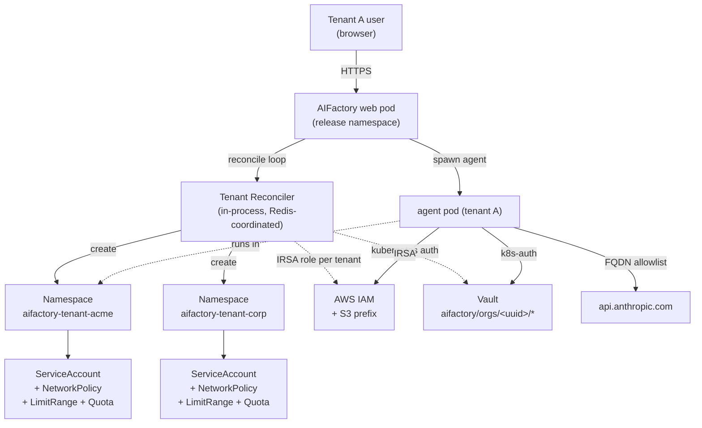

# Tenant Isolation Mode (Epic #35 #36)

> *Opt-in per-deployment toggle that gives every Organization its own Kubernetes namespace, ServiceAccount, NetworkPolicy, S3 prefix + IAM role, and Vault path. Closes the v1.0 limitation where all organizations in a deployment trust each other implicitly. See [Epic #35 #36](https://github.com/olafkfreund/AIFactory/issues/36).*

## When you need this

You want Tenant Isolation Mode when **any** of these apply:

- **Multi-tenant SaaS or MSP deployments** — one AIFactory install serving many client organizations that must not see each other's data, agent activity, or workspace files.
- **Internal "Chinese Wall" requirements** — one bank, one deployment, hostile internal teams (trading vs M&A, risk vs sales) that need provable separation for compliance.
- **ISO 27001 A.13.1 (network segmentation) or SOC2 CC6.1 (logical access)** — auditors asking how you prevent tenant A's agent from exfiltrating data to tenant B's namespace.
- **Regulatory requirements for per-tenant data residency** — every tenant's workspace files live in their own S3 prefix with their own IAM role, with no shared paths.

You **don't** need it for:

- Laptop installs / dev sessions.
- Single-organization deployments where one team owns everything.
- Deployments where all organizations are equally trusted (e.g. one company's internal teams without segregation duties).

Pre-#36 deployments are byte-for-byte unchanged until the operator flips `tenant.isolationEnabled=true`.

## What's in scope (and what's not)

| Aspect | v1.1 status |
|--------|-------------|
| Per-tenant Kubernetes Namespace, ServiceAccount, NetworkPolicy | Yes |
| Per-tenant S3 prefix + IAM role (AWS / IRSA) | Yes |
| Per-tenant Vault path + policy | Yes |
| ResourceQuota + LimitRange caps per tenant | Yes |
| FQDN-based egress allowlist (Calico OR Cilium) | Yes |
| Soft-delete + 30-day infra grace + immediate PII scrub | Yes |
| OPA Gatekeeper sample policies (opt-in defence-in-depth) | Yes |
| Stuck-terminating namespace detection + operator alerts | Yes |
| Per-tenant audit-chain anchor | No (v1.2) |
| Per-tenant LLM provider routing | No (Epic #35 #38 LiteLLM gateway) |
| Per-tenant Postgres database | No (v2.0 separate epic) |
| Cross-cluster isolation (one cluster per tenant) | No (use multiple Helm installs) |
| OpenShift-specific SCCs | No (parking lot) |
| Kata Containers / Firecracker | No (gVisor only — Epic #35 #37) |

## Threat model

| Threat | Pre-#36 | Post-#36 (isolated mode) |
|--------|---------|--------------------------|
| Tenant A's web client reads tenant B's audit log | Defended (DB `org_id` filter) | Defended (same) |
| Tenant A's prompt exfiltrates data to attacker URL | **Undefended** (agent egress open) | Defended (NetworkPolicy default-deny + FQDN allowlist) |
| Tenant A's agent reads tenant B's workspace files (S3) | **Partially undefended** (relies on app filter) | Defended (IAM `s3:prefix` condition) |
| Tenant A's agent reads tenant B's Vault secrets | **Partially undefended** (relies on app filter) | Defended (Vault policy `aifactory/orgs/<uuid>/*` only) |
| Compromised tenant A pod schedules into tenant B's namespace | N/A (one namespace) | Defended (per-tenant SA has no cross-namespace RBAC) |
| Web pod compromise → cluster-wide breakout | Mitigated (web pod has limited RBAC) | **Partially undefended** without gVisor + Gatekeeper; defended with both enabled (see security caveat below) |
| Reconciler bug creates wrong tenant's resources | N/A | Detected via `reconcile_error` log + audit |

## Architecture



## Turning it on

The `tenant:` block in `values.yaml`:

```yaml
tenant:
  isolationEnabled: true
  deletionGraceDays: 30
  namespacePrefix: "aifactory-tenant"
  networkPolicy:
    cniBackend: "auto"          # auto | calico | cilium
  limitRange:
    defaultCpu: "500m"
    defaultMemory: "512Mi"
  resourceQuota:
    maxPods: 50
    maxPvcs: 20
  gatekeeperEnabled: false      # opt-in OPA samples
  teardown:
    cronSchedule: "0 3 * * *"   # daily 03:00 UTC
    dryRunHours: 24             # 24h log preview before actual delete
```

Then:

```bash
helm upgrade aifactory ./charts/aifactory \
  -f your-values.yaml \
  --set tenant.isolationEnabled=true
```

The chart's `pre-install` / `pre-upgrade` hook runs a one-shot `Job` (`tenant-cni-probe`) that checks for `globalnetworkpolicies.crd.projectcalico.org` (Calico) or `ciliumnetworkpolicies.cilium.io` (Cilium) CRDs. If neither is present and `cniBackend` is `auto` (or the requested backend's CRD is missing), the install **fails loudly**:

```
FAIL: Tenant Isolation requires Calico or Cilium FQDN-policy support.
Found neither CRD. Either install one of those CNIs, or set
tenant.isolationEnabled=false.
```

Operators see this at `helm install` time — not as silent breakage at first reconcile.

## Operator prerequisites

Before flipping the toggle:

1. **CNI plugin with FQDN-policy support** — install [Calico](https://docs.tigera.io/) (FQDN beta) OR [Cilium](https://docs.cilium.io/) (`CiliumNetworkPolicy` CRD). The pre-install hook gates the chart on this. Stock flannel / weave-net / kube-router do NOT work.

2. **Redis enabled** (`redis.enabled=true`) — multi-replica deployments need the reconciler's distributed mutex (Redis `SETNX` per org-id, 60s TTL). Single-replica deployments may run without Redis but the reconciler **refuses to write** if Redis is unavailable mid-tick.

3. **Vault `aifactory-reconciler` AppRole pre-created** with the minimum-needed capabilities:

   ```hcl
   path "sys/policies/acl/aifactory-tenant-*" {
     capabilities = ["create", "update", "delete", "read"]
   }
   path "auth/kubernetes/role/aifactory-tenant-*" {
     capabilities = ["create", "update", "delete", "read"]
   }
   ```

   **Never** use a root token for the reconciler — documented as a forbidden anti-pattern. The reconciler must NOT be able to read tenant secrets, only manage the policies that grant access to them.

4. **(AWS only) IRSA enabled** on the cluster so per-tenant IAM roles can be assumed by per-tenant ServiceAccounts. AKS Workload Identity / GKE Workload Identity are the equivalent on Azure / GCP — see "Per-tenant credentials on non-AWS clouds" below.

## Why we recommend OPA Gatekeeper

Kubernetes RBAC does **NOT** support prefix-based namespace scoping at the RoleBinding level. A ClusterRole with `create namespaces` + `create rolebindings` (which the reconciler needs to provision tenant namespaces at run time) is **effectively cluster-admin**. A compromised web pod can create arbitrary namespaces + bindings, not just `aifactory-tenant-*` ones.

This is a **known privilege concentration** in v1.1. We document it honestly rather than hide it.

Production deployments **should** close the gap with both:

1. **`sandbox.gvisor.enabled=true`** (Epic #35 #37) — syscall-level isolation on the web pod so a process compromise can't escape the container without first defeating gVisor.

2. **`tenant.gatekeeperEnabled=true`** — ships two OPA Gatekeeper sample policies that the operator's existing Gatekeeper installation enforces at the admission-controller level:

   - **`AIFactoryTenantNamespacePrefix`** — denies any Namespace `CREATE` whose name doesn't start with `<namespacePrefix>-` (exempting `kube-system`, `kube-public`, `kube-node-lease`, `gatekeeper-system`, and the release namespace).
   - **`AIFactoryTenantRoleBindingScope`** — denies any RoleBinding whose `subjects` include the web pod's ServiceAccount in a non-tenant namespace.

The samples are inert templates by default (`gatekeeperEnabled: false`). When opted in, they instantiate against the operator's configured `namespacePrefix` + reconciler SA. Operators with their own Gatekeeper governance may need to merge the Rego with existing rules.

**Roadmap (v2.x):** extract the reconciler into a separate Operator pod (Kopf-based controller watching `AIFactoryOrg` CRDs) with a tighter ServiceAccount that supports prefix matching at the API-server level. The in-app reconciler ships in v1.1 because it's under half the maintenance cost while the threat model accepts the privilege concentration.

## Tear-down lifecycle

Org delete is a **two-stage** flow that distinguishes between PII (which GDPR Art. 17 requires deleted "without undue delay") and infrastructure (which often needs an operator grace period for mistaken-delete recovery or legal-hold negotiation).

### Stage 1 — Soft delete (immediate)

Triggered by `DELETE /api/orgs/<id>` or the operator setting `organizations.deleted_at` directly:

- `User.email` and `User.name` are nulled for every User whose membership is exclusively to this org.
- `audit_logs.user_id` for this org's rows is hashed to a stable opaque ID (preserves the audit chain; satisfies the GDPR-vs-audit tension).
- The reconciler marks `tenant_states.isolation_mode='deleted'`; the agent spawner refuses **new** task starts for this org.
- Existing agent pods continue running until completion; no new pods can be created for this org.

### Stage 2 — Tear-down (day 30 by default)

Triggered by the daily `tenant-teardown` CronJob (`tenant.teardown.cronSchedule`, default `0 3 * * *` UTC):

- The cron loads every org with `(now - deleted_at) > tenant.deletionGraceDays days`.
- For each, the reconciler:
  - Deletes the Kubernetes Namespace (K8s cascades to all child resources).
  - Recursively deletes the S3 prefix (with the prefix-shape assertion below).
  - Deletes the Vault path + policy + Kubernetes auth role.
  - Removes the IAM role (AWS) or operator-supplied credentials.
  - Removes the `tenant_states` row.
- An audit log row with `classification='confidential'` records the tear-down.

### 24-hour dry-run preview

Per design §4a, the cron logs every candidate at INFO with a `DRY-RUN: would tear down` line during the `tenant.teardown.dryRunHours` window after the grace period elapses. This gives operators a final window to intervene if a tear-down was triggered in error.

```
DRY-RUN: would tear down org abc-123
  (deleted_at=2026-04-28T14:02Z, grace=30 days, dry_run=24 hours);
  actual delete after dry-run window expires
```

The actual delete fires on the cron tick after the dry-run window closes. Set `tenant.teardown.dryRunHours=0` to disable the dry-run pass (deletions execute on the first tick after grace expires).

### S3 recursive-delete safety

Stage-2's `s3 rm` **must** refuse to delete any prefix that doesn't match `^orgs/[0-9a-f-]{36}/$`. This guards against a misconfigured reconciler accidentally deleting the bucket root if `tenant_states.namespace_name` were ever blank. The assertion lives in `_tear_down_s3()` in the reconciler.

### Stuck-terminating namespace handling

Kubernetes Namespace deletion can stall indefinitely on stuck finalizers (e.g. ExternalSecret CRs with stale ESO finalizers, custom CRDs whose controllers are unavailable). The reconciler detects:

```python
if (
    ns.status.phase == "Terminating"
    and (now - ns.metadata.deletionTimestamp) > timedelta(minutes=30)
):
    # Operator alert: audit log + WARNING + tenant_states.reconcile_error.
    # Force-finalizer-removal is NOT automated — that's a destructive op
    # that should require an operator decision.
```

Operators see stuck tear-downs via:

```sql
SELECT org_id, reconcile_error
FROM tenant_states
WHERE deleted_at IS NOT NULL
  AND reconcile_error IS NOT NULL;
```

The audit log + WARNING fires every reconcile tick until the operator intervenes (typically by manually removing the stuck finalizer).

### GDPR Art. 17 distinction

The 30-day grace period applies to **infrastructure** resources only (namespace, S3 prefix, Vault path). **PII** (`User.email`, `User.name`, audit-log `user_id`) is scrubbed **immediately** on Stage-1 soft-delete. This satisfies GDPR Art. 17's "without undue delay" for personal data while the infrastructure grace period covers operational recovery.

Operators wanting different grace periods set `tenant.deletionGraceDays`. **Day-0** (immediate) is allowed but produces a WARNING log on every reconcile pass reminding the operator of the recovery-window loss:

```
WARNING: tenant.deletionGraceDays=0 — Stage-2 tear-down fires
immediately on soft-delete; no recovery window for mistaken-delete
or legal hold. Consider deletionGraceDays>=7 for production.
```

## Slug-rename UX

Once an org has been reconciled, its namespace name (`aifactory-tenant-<slug>`) is **immutable** — stored in `organizations.tenant_namespace` and locked for the org's lifetime. Subsequent `PATCH /api/orgs/<id>` slug renames do **not** rename the namespace (K8s does not support namespace rename).

To surface this to operators + frontend users, every slug change on an org with an existing `tenant_namespace` emits:

- An audit log entry at WARNING severity (`org.slug.rename`, classification `internal`, `details_json` records old + new slug + the now-stale namespace name).
- A Kubernetes Event of type `Warning`, reason `SlugRenamed`, on the tenant namespace (visible in `kubectl describe ns aifactory-tenant-<old-slug>`).
- A response-body field `tenant_namespace_unchanged: true` so the frontend renders an inline warning: *"This org's Kubernetes namespace is `aifactory-tenant-acme` (the original slug). To change the namespace name, recreate the org with the new slug."*

If a slug rename matters operationally, the operator's only recourse is to recreate the org with the new slug (and migrate workspace files manually).

## Per-tenant credentials on non-AWS clouds

The default S3 IAM model (one role per tenant via IRSA) targets AWS / EKS. For other clouds, the equivalent isolation story is **operator-supplied per-tenant credentials**:

- **GKE (Workload Identity)** — annotate each tenant's ServiceAccount with `iam.gke.io/gcp-service-account=<tenant-sa>@<project>.iam.gserviceaccount.com`. Pre-create the per-tenant GCP SAs with bucket-prefix IAM bindings.
- **AKS (Pod Identity / Workload Identity)** — bind each tenant's K8s SA to an Azure Managed Identity scoped to the per-tenant blob container.
- **On-prem / bare metal** — provision per-tenant static credentials as Kubernetes Secrets in each tenant namespace. Less attractive (credentials live in K8s, not in cloud IAM), but workable for clusters without cloud-native identity.

The reconciler emits the right SA annotations based on `TENANT_CLOUD_PROVIDER` (set via Helm). PR-2's K8s layer documents the per-cloud examples in the operator runbook.

## Failure modes

Per the failure-safe contract that AIFactory uses across all integrations:

| Failure | Behaviour |
|---------|-----------|
| Reconciler raises mid-pass | Caught + logged WARNING + recorded in `tenant_states.reconcile_error`; pod stays up |
| Redis unavailable | Reconciler refuses to write (single-replica is the only safe mode without distributed mutex); WARNING log every tick |
| Vault unavailable | Per-tenant Vault policy not provisioned; agent pods fail Vault token issue with a clear error; previous tick's state preserved |
| AWS IAM rate-limited | One tenant's IAM role create fails; next tick retries; other tenants unaffected |
| K8s namespace stuck-terminating > 30 min | Operator alert (audit log + WARNING + `reconcile_error`); operator must investigate finalizers manually |
| CNI plugin missing FQDN support | Helm pre-install hook hard-fails; operator sees the error at install time, not at first reconcile |
| Namespace finalizer + custom CRD with absent controller | Stuck-terminating handling fires; reconciler does NOT force-remove the namespace finalizer (destructive op) |

A broken reconciler does **NOT** crash the web pod — the lifespan task catches all exceptions; structured log + sleep + retry. Operators query `tenant_states.reconcile_error` for visibility:

```sql
SELECT org_id, isolation_mode, reconcile_error
FROM tenant_states
WHERE reconcile_error IS NOT NULL;
```

## Operator workflow

### Enabling tenant isolation on an existing deployment

1. **Install Calico or Cilium** (if not already present).
2. **Provision Vault `aifactory-reconciler` AppRole** with the minimum-needed capabilities (sample Terraform module in `examples/terraform/vault-reconciler-approle/`).
3. **Enable Redis** (`redis.enabled=true`) — required for multi-replica safety.
4. **Bump values.yaml**: `tenant.isolationEnabled=true`. Optionally enable `tenant.gatekeeperEnabled=true` if Gatekeeper is installed.
5. **`helm upgrade`** — the pre-install hook validates CNI capability + the rest of the chart deploys.
6. **Observe first reconciles**: `kubectl logs -l app.kubernetes.io/name=aifactory | grep tenant_reconciler`. The reconciler creates one tenant namespace per existing org over the next few ticks.
7. **In-flight tasks** continue in the shared namespace; new tasks start in the per-tenant namespace.

### Decommissioning an org

```sql
UPDATE organizations SET deleted_at = NOW() WHERE id = 'org-uuid';
```

- Stage 1 (immediate): PII scrubbed, new tasks refused.
- Stage 2 (day 30 + dry-run window): infrastructure deleted by the cron.

### Monitoring tear-down health

Add to your alerting:

```sql
-- Stuck tear-downs > 7 days past their grace period.
SELECT org_id, reconcile_error
FROM tenant_states
WHERE deleted_at IS NOT NULL
  AND deleted_at < NOW() - INTERVAL '37 days'
  AND reconcile_error IS NOT NULL;
```

Alert when this returns >0 rows — the operator needs to intervene (typically a stuck finalizer or expired cloud credentials).

### Tenant-secret rotation in Vault

`vault kv put aifactory/orgs/<org-uuid>/whatever value=...` — standard Vault CLI; the existing `vault kv metadata` works unchanged for backup/restore.

## Compatibility with other Helm toggles

- **`audit.anchor.enabled`** — independent. Per-tenant audit-chain anchor is a v1.2 work item; v1.1 has one chain across all tenants.
- **`workspaces.storage.enabled`** — pairs naturally. Per-tenant IAM roles scope S3 access to the tenant's prefix.
- **`redis.enabled`** — **required** for multi-replica safety (distributed mutex).
- **`sandbox.gvisor.enabled`** — strongly recommended together (closes the web pod's privilege concentration).
- **`otel.enabled`** — independent. Per-tenant span attributes are added automatically when tenant isolation is on.

## Further reading

- Design doc: `docs/plans/2026-05-28-tenant-isolation-design.md` (locked design with 6 reviewer-audited refinements).
- ISO 27001 evidence: see `guides/compliance/iso27001-evidence.md` A.13.1 (network segmentation), A.9.2 (privileged access), A.18.1 (legal compliance).
- Companion concepts: [Audit anchor](./audit-anchor.md), [gVisor sandbox](./gvisor-sandbox.md), [Multi-replica deployments](./multi-replica.md).
