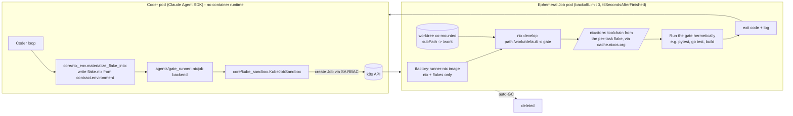
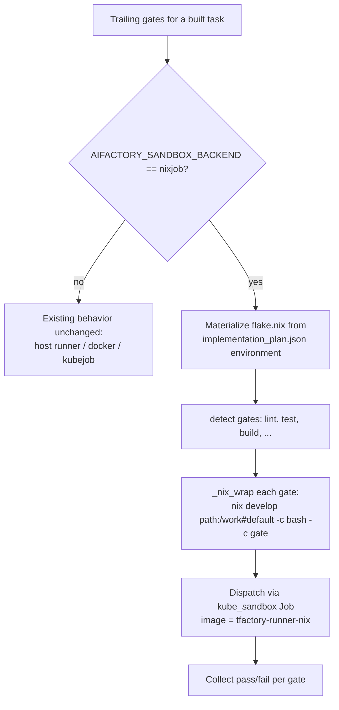

# Building in a per-task Nix flake (RFC-0005 Tier A)

This page explains, from AIFactory's side, how the coder builds and runs verification
gates inside a reproducible per-task Nix environment, and why that matters: AIFactory
builds in the SAME flake TFactory later verifies in, so the build environment and the
verify environment cannot drift.

For the end-to-end fleet picture (PFactory declares the toolchain, TFactory verifies
and captures screenshots) see the hub guide "Reproducible test environments". For how
the plan itself is shown to be buildable and testable, see PFactory's "Planning and
Trust" guide.

## Why a Job, not the coder pod

The coder is a long-lived agent loop (the Claude Agent SDK) running in a single
deployment pod. That pod has no container runtime — it cannot `docker run`. So the
execution of build and verification gates is pushed into an ephemeral Kubernetes Job,
created via the in-cluster API. The agent loop stays in the coder pod; only the
toolchain-bearing work runs in the Job.

The Job backend is `core/kube_sandbox.py` (proven in-cluster). Which backend a gate
uses is selected in `agents/gate_runner.py` by the `AIFACTORY_SANDBOX_BACKEND`
environment variable.

## How the coder creates a build pod and how flake.nix sandboxes it



What flake.nix does as the sandbox boundary:

- `core/nix_env.materialize_flake_into()` writes a `flake.nix` into the task worktree
  from the contract `environment` manifest (the same manifest PFactory emitted and
  TFactory consumes). It respects a repo-owned `flake.nix` unless the manifest marks the
  flake as `generated`.
- `nix develop` realises exactly the pinned dependency closure into `/nix/store` and puts
  only those tools on `PATH`. The image carries only Nix itself — every toolchain comes
  from the flake, so there is no per-language image to maintain.

## The build-gate decision flow



### The `path:/work` detail (do not drop it)

`_nix_wrap` builds `nix develop path:/work#default -c bash -c "<gate>"`. The `path:`
reference is required for a co-mounted git worktree. A bare `/work` reference makes Nix
use its git fetcher, which (1) rejects the repo on a uid mismatch (the Job runs as root,
the worktree files are owned by the non-root service uid) and (2) ignores the untracked,
freshly generated `flake.nix`. `path:` copies the directory directly, sidestepping both.
This was proven the hard way in TFactory's live runs.

## Adoption — what teams and operators do

The Nix build path is opt-in and default-off. With it off, gate behavior is exactly as
before (host runner), so turning it on is a deliberate operational choice.

To build in the per-task Nix env, set on the AIFactory deployment:

```
AIFACTORY_SANDBOX_GATES=1
AIFACTORY_SANDBOX_BACKEND=nixjob
AIFACTORY_SANDBOX_IMAGE=ghcr.io/olafkfreund/tfactory-runner-nix:latest
```

Nothing else is required: `flake.nix` is generated from the contract `environment`, so
teams do not hand-write flakes or maintain language images.

Honest status: the AIFactory-side Nix gate path is implemented and unit-tested (the gate
runner suite is green) and uses the same provisioner and `nix develop path:/work` recipe
that TFactory has already validated live end-to-end (real toolchains and browser
screenshots from a cluster Job). The AIFactory-side live validation is pending the
environment flip above; until an operator enables it, the host runner remains in effect.

## Node-agnostic packed builds (RFC-0017 #190)

Everything above is about the **gate** Job — the thin `tfactory-runner-nix` pod that runs
one verification gate wrapped in `nix develop`. There is a second, separate consumer of
`/nix`: the **build** Job. When `AIFACTORY_BUILD_BACKEND=kubejob`, the whole coder loop
(`run.py`) runs as its own Job, and the coder runs its inline gates through
`nix develop` — so the build Job needs a populated `/nix/store` too, even though `run.py`
itself is not wrapped in `nix develop`.

For a while the fast way to give it one was a **warm `/nix/store` PVC** — a shared cache
so repeat builds did not re-realise the world. The catch: that PVC is RWO `local-path`,
physically a directory on one node, so mounting it pinned every build Job back to that
node. Packing the workspace to object storage (`AIFACTORY_PACK_WORKSPACE`) had already
removed the `/work` pin; the Nix-store PVC was the last wire holding a packed build to a
single node — the blocker to scheduling builds across a cluster.

The fix is to make the store a layer instead of a volume:

```
AIFACTORY_PACK_WORKSPACE=true
AIFACTORY_PACKED_NIX_IN_IMAGE=true
AIFACTORY_BUILD_IMAGE=ghcr.io/olafkfreund/aifactory:<sha>-nix
```

- The `-nix` image is the ordinary AIFactory runtime image **plus a baked `/nix/store`**
  (Dockerfile `build-runtime` stage). It is published on demand by its own workflow
  (`Publish -nix build image`), kept out of the per-commit deploy so the multi-GB store is
  not rebuilt on every push.
- `AIFACTORY_PACKED_NIX_IN_IMAGE=true` makes the dispatcher **drop the Nix-store PVC** from
  the build Job manifest on the packed path; the build resolves `/nix` from the image.
- `AIFACTORY_BUILD_IMAGE` overrides the image for the build Job only — precedence is
  `AIFACTORY_BUILD_IMAGE` > `AIFACTORY_IMAGE` > built-in default — so the control plane and
  the gate Jobs keep running their normal images; only the build Job picks up the `-nix`
  tag.

With all three set, a packed build Job carries **no workspace PVC and no Nix-store PVC**,
and therefore **no node affinity**: the scheduler places it freely.

Honest status: shipped and wired into the reference deployment (gitops). The chain is
verified at every layer that does not need new hardware — the `-nix` image is published and
resolvable, the manifest the dispatcher emits for a packed build has no Nix-store volume,
and the toolchain resolves from the baked store. What is not yet demonstrated is an actual
landing on a *different* node, because the live cluster is single-node today; that proof is
gated on a second node, not on more code.

## Where it lives

| Concern | Module |
| --- | --- |
| Job backend (create / watch / logs / delete) | `core/kube_sandbox.py` |
| Backend selection + Nix gate wrapper | `agents/gate_runner.py` (`nixjob`, `_nix_wrap`, `_nix_kube_runner`) |
| Materialize flake from the contract | `core/nix_env.py` (`materialize_flake_into`) |
| Flake generator (vendored from the hub) | `core/nix_provisioner.py` |
| Coder hook (materialize before gates) | `agents/coder.py` |
| Build-Job backend + image resolution + nix-in-image depin | `services/build_backend.py` (`_resolve_build_image`, `AIFACTORY_PACKED_NIX_IN_IMAGE`) |
